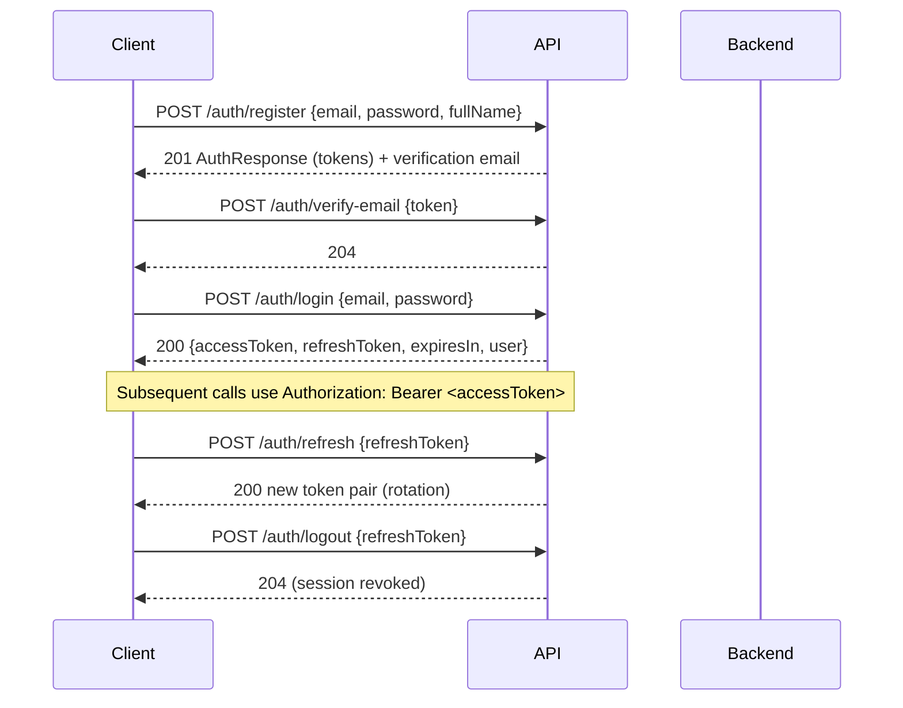

# Creative Digital Company — API Specification

- **Document type:** API specification (OpenAPI 3.0.3)
- **Author:** CTO (Founding Engineer)
- **Version:** 1.0
- **Status:** Draft for board review
- **Date:** 2026-08-02
- **Companion docs:** [Technology Strategy](/CRE/issues/CRE-6#document-technology-strategy),
  [System Architecture](/CRE/issues/CRE-6#document-system-architecture),
  [Backend Architecture](/CRE/issues/CRE-6#document-backend-architecture),
  [Database Architecture](/CRE/issues/CRE-6#document-database-architecture)
- **Source of truth:** [`openapi.yaml`](https://github.com/shakeel121/creative-digital-company/blob/main/openapi.yaml)
  — a machine-readable OpenAPI 3.0.3 document. This summary explains the design and conventions.

---

## 0. Overview

The complete REST API contract for the platform, defined once as **OpenAPI 3.0.3** in
[`openapi.yaml`](https://github.com/shakeel121/creative-digital-company/blob/main/openapi.yaml).
It is the single source of truth consumed by backend (NestJS DTO generation), frontend (typed API
client generation), and documentation tooling (Swagger UI / Stoplight).

> **No implementation code.** This document and the YAML define the contract only, aligned with the
> Backend Architecture (NestJS + Clean Architecture) and Database Architecture (Prisma models).

---

## 1. Domain coverage

| Domain            | Operations                                                              | Notes                                        |
| ----------------- | ----------------------------------------------------------------------- | -------------------------------------------- |
| **Authentication**| register, login, refresh, logout, verify-email (+resend), forgot/reset password | JWT bearer + rotating refresh tokens; no account enumeration on forgot-password |
| **Users**         | get/update self, change password, get user by id, search users          | Company-scoped visibility                    |
| **Companies**     | create, list, get, update, members (list/invite/role/remove), accept invitation | Roles: owner, admin, editor, viewer, billing |
| **Documents**     | create, list (filters), get, update, soft-delete, revisions (list/get)  | Versioned revisions, optimistic concurrency via `baseRevisionId` |
| **AI**            | generate (sync), chat, jobs (enqueue/list/get)                          | Async job model for long generations; usage tracking |
| **Payments**      | plans, checkout, subscription (get/change/cancel), invoices (list/get/PDF), webhook | Provider-signed webhook (public)             |
| **Notifications** | list, unread-count, mark read, read-all, preferences (get/update)       | Channels per notification type               |
| **Admin**         | metrics, users (list/update), companies (list/update), feature flags, audit log | Admin-only, RBAC-guarded                |

**Counts:** 8 tags, 44 paths, 54 operations, 33 schemas, 6 shared parameters, 7 standardized
response components.

---

## 2. Conventions

The API follows the Backend Architecture conventions (§5–11):

- **Transport:** HTTPS + JSON, `camelCase` field names.
- **Auth:** `Authorization: Bearer <accessToken>` (JWT). All non-public operations declare
  `security: [bearerAuth]`; the single public operation is the provider webhook
  (`POST /payments/webhooks`, marked `x-public: true`).
- **Identifiers:** CUID strings validated server-side (matches Prisma PKs).
- **Pagination:** envelope `{ data, meta: { page, pageSize, total } }`; defaults `page=1`,
  `pageSize=20`, max 100.
- **Errors:** standard body
  `{ statusCode, error, message, path, timestamp, requestId }`; `requestId` is the correlation ID
  across gateway → function → logs (System Architecture §12).
- **HTTP status usage:** `400` validation, `401` unauthenticated, `403` forbidden, `404` not found,
  `409` conflict (incl. stale `baseRevisionId`), `429` rate-limited, `402` payment required,
  `5xx` sanitized server errors.
- **Optimistic concurrency:** document updates require `baseRevisionId`; server returns `409` when
  the document changed since the client last read it.
- **Soft delete:** `DELETE /documents/{id}` is a soft delete; deleted documents are excluded from
  list queries (Database Architecture §8).

---

## 3. Authentication flow

- Access tokens are short-lived (e.g., 15 min); refresh tokens are rotated and stored hashed
  (Backend Architecture §9, Database `sessions`).
- Password reset uses a signed, expiring token; responses are identical whether or not the account
  exists (no enumeration).

---

## 4. Authorization model

- **RBAC at the API layer** via roles (company member roles + global admin) enforced by guards on
  each route. Admin endpoints (`/admin/**`) require the `admin` capability.
- **RLS at the database** remains the final authority on data visibility; the API contract assumes
  every query is tenant-scoped to the caller's company (Backend Architecture §10).

---

## 5. How the spec is used (tooling)

- **Backend:** response DTOs are generated/verified against these schemas; `class-validator` rules
  mirror the YAML constraints (min/max lengths, enums, formats).
- **Frontend:** typed API client (e.g., `openapi-typescript`) generated from `openapi.yaml` so the
  frontend and backend can never drift.
- **Docs:** Swagger UI / ReDoc renders the same YAML for developers.
- **Contract tests:** E2E tests assert responses match schemas (Backend Architecture §16).

---

## 6. Production-hardening notes (API)

- [ ] Every protected route declares `bearerAuth`; no implicit globals.
- [ ] Rate limiting applied to auth + AI + write routes (`429` defined).
- [ ] `requestId` on every response for correlation.
- [ ] Webhook endpoint signature-verifies provider payloads.
- [ ] No PII/secrets in logs or error messages (Backend Architecture §12).
- [ ] Validation is whitelist-based; unknown fields rejected (`400`).

---

## 7. Next action

Board review/adoption of this API specification. On approval, the CTO will:
1. Generate the typed client + Swagger UI wiring as part of the M5 backend scaffold.
2. Implement the first feature module (`documents`) end-to-end against these schemas, with E2E
   contract tests asserting the exact response shapes.
3. Add the payments + webhook endpoints when the billing provider is chosen (Roadmap M7).
