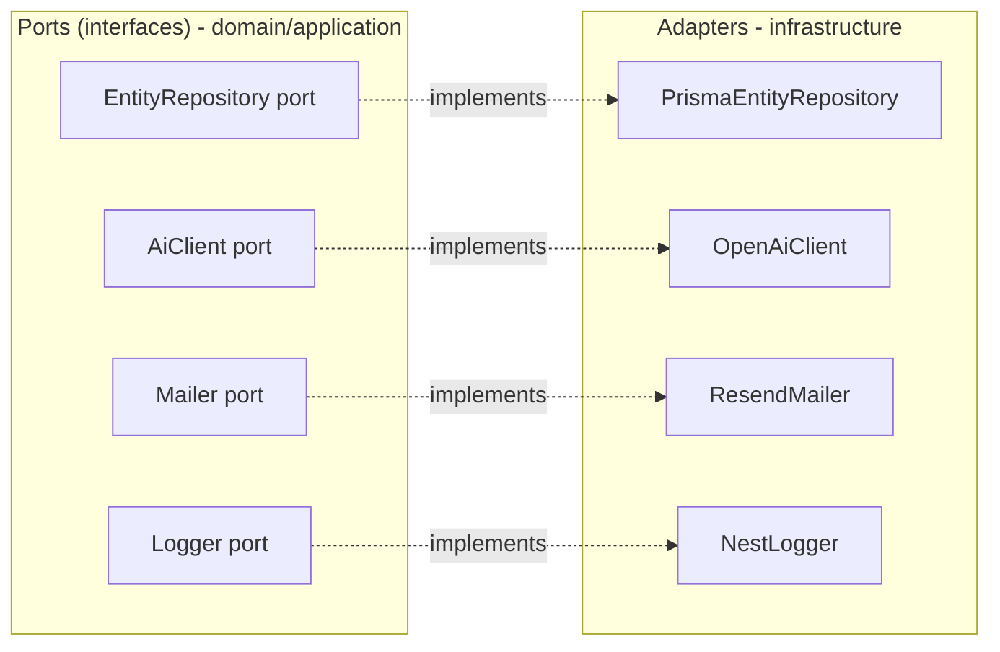
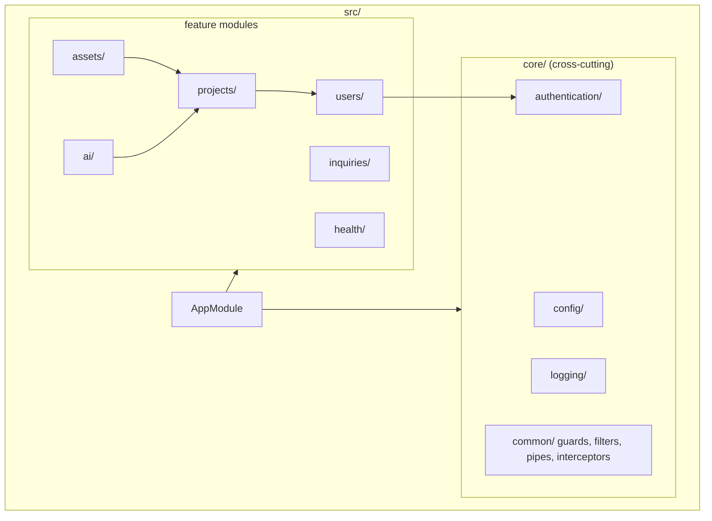
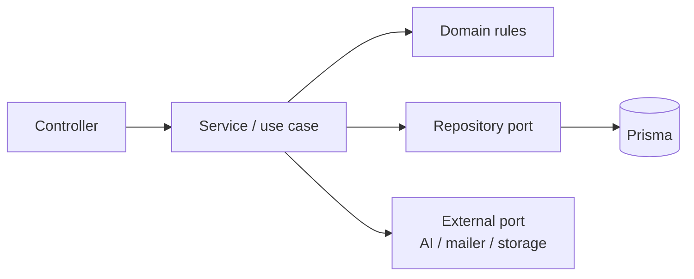
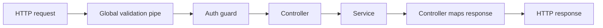
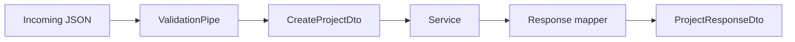
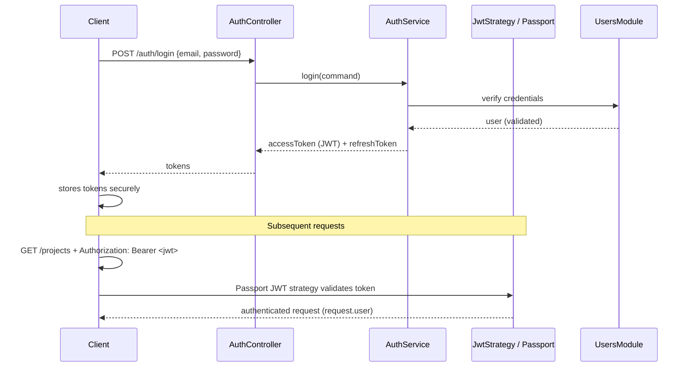
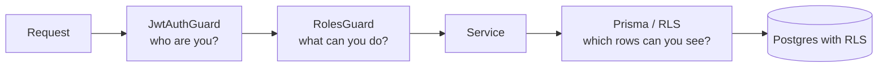
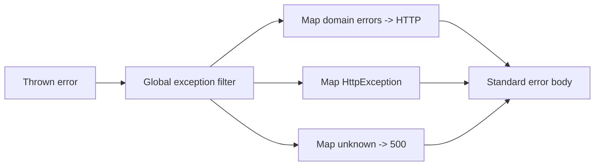
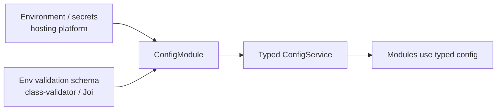
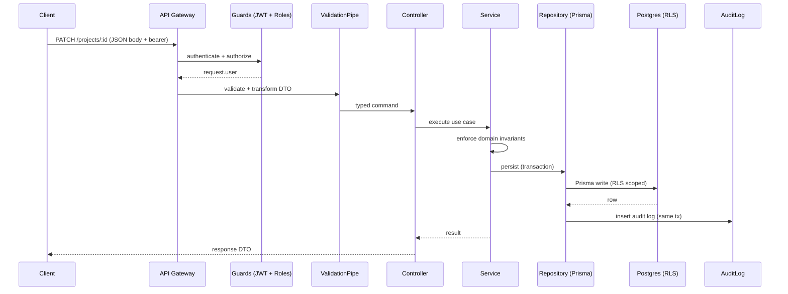

# Creative Digital Company — Backend Architecture

- **Document type:** Backend architecture (NestJS + Clean Architecture)
- **Author:** CTO (Founding Engineer)
- **Version:** 1.0
- **Status:** Draft for board review
- **Date:** 2026-08-02
- **Companion docs:** [Technology Strategy](/CRE/issues/CRE-6#document-technology-strategy),
  [System Architecture](/CRE/issues/CRE-6#document-system-architecture),
  [Database Architecture](/CRE/issues/CRE-6#document-database-architecture)
- **Adoption trigger:** first interactive/server-backed product (Roadmap M4/M5). This document
  defines how the serverless API layer in the System Architecture is built and organized.

---

## 0. Overview

The backend is a **NestJS application** following **Clean Architecture**: business rules live at the
center, framework and infrastructure details at the edges, dependencies always point inward. NestJS
provides the module system, DI container, controllers, guards, pipes, interceptors, and config/logger
primitives; Clean Architecture keeps the domain portable and testable.

> **No implementation code is included.** This document is the design: modules, responsibilities,
> layering, request flow, and conventions. Everything maps to the System Architecture (§4 backend,
> §9 API gateway) and the Database Architecture (Prisma models).

---

## 1. Clean Architecture layering

```mermaid
flowchart TB
    subgraph Outer["Outer layer (adapters - framework/infra)"]
        HTTP[HTTP / REST controllers<br/>NestJS]
        AUTH2[Auth guard / passport strategies]
        PIPE[Validation pipes / DTOs]
        REPO2[Repositories (Prisma)]
        EXT[External clients<br/>AI, email, storage, queue]
        EXC[Exception filters]
    end

    subgraph App["Application layer (use cases)"]
        SRV[Services / use cases]
        CMD[Commands & Queries]
    end

    subgraph Domain["Domain layer (core)"]
        ENT[Entities & value objects]
        INT[Domain interfaces / ports]
        RULES[Business rules & invariants]
    end

    HTTP --> PIPE
    PIPE --> SRV
    SRV --> INT
    INT --> RULES
    RULES --> ENT
    SRV --> CMD
    SRV --> REPO2
    REPO2 --> ENT
    AUTH2 --> SRV
    EXT --> SRV
    EXC --> SRV
```

**Dependency rule:** source-code dependencies point **only inward**. The domain layer knows nothing
about NestJS, Prisma, HTTP, or external services. The application layer orchestrates use cases.
Adapters (controllers, repositories, external clients) implement ports declared by inner layers.



---

## 2. Module structure

**Folder layout (feature-first, mirrors Clean Architecture layers):**



Each feature module contains the four Clean-Architecture layers:

```
src/
├─ projects/
│  ├─ projects.module.ts          # NestJS module definition
│  ├─ projects.controller.ts      # HTTP adapter (controller)
│  ├─ projects.service.ts         # use case orchestration
│  ├─ dto/
│  │  ├─ create-project.dto.ts    # input validation
│  │  └─ update-project.dto.ts
│  ├─ entities/
│  │  └─ project.entity.ts        # domain entity
│  ├─ repositories/
│  │  ├─ project.repository.port.ts  # port (interface)
│  │  └─ prisma-project.repository.ts # adapter (Prisma)
│  └─ ...
```

---

## 3. Modules

| Module            | Responsibility                                            | Depends on                     |
| ----------------- | --------------------------------------------------------- | ------------------------------ |
| `AppModule`       | Root module: wires config, global pipes/guards/filters    | all                            |
| `ConfigModule`    | Loads env config, validates, exposes typed config service | —                              |
| `AuthModule`      | Login/logout, JWT issue+verify, refresh tokens            | `ConfigModule`, `UsersModule`  |
| `UsersModule`     | User accounts, membership, roles                          | `AuthModule` (guards)          |
| `ProjectsModule`  | Project CRUD + lifecycle (domain core)                    | `UsersModule`, `AssetsModule`  |
| `AssetsModule`    | Asset metadata + storage orchestration                    | `ProjectsModule`               |
| `InquiriesModule` | Inbound inquiry lifecycle (new → contacted → closed)      | `ProjectsModule`, `MailerPort` |
| `AiModule`        | AI proxy/copilot behind safety layer                      | `ConfigModule`, `AiClientPort` |
| `HealthModule`    | `/health` + `/ready` probes                               | —                              |

**Module rules:**
- One bounded responsibility per module; modules import only what they need.
- Cross-cutting concerns (logging, config, exceptions) come from `core/`, not duplicated.
- Feature modules never import each other's internals; they communicate via ports/services.

---

## 4. Services (application layer)

Services implement **use cases**: they orchestrate domain rules and ports, hold no HTTP or Prisma
knowledge, and are the only layer application logic may live in.

**Per use case:**
- **Commands** — state-changing operations (e.g., `CreateProjectCommand` handled by
  `createProject`).
- **Queries** — read operations (e.g., `ListProjectsQuery` handled by `listProjects`).

**Service conventions:**
- One method per use case; methods are thin orchestrators over domain entities + ports.
- Transactions live at the service level (Prisma `$transaction` through a repository that accepts a
  transaction context).
- Services are framework-agnostic and unit-testable with fakes for ports.



---

## 5. Controllers

Controllers are the **HTTP adapter only** — no business logic.

- **Route mapping:** `@Controller('projects')` with `@Get`, `@Post`, `@Patch`, `@Delete`.
- **Input:** DTOs validated by a global `ValidationPipe`.
- **Output:** use-case results mapped to response shapes (no entities leaked directly unless
  intended).
- **Errors:** never caught in controllers; domain errors propagate to the global exception filter.
- **Auth:** `@UseGuards(AuthGuard)` + `@Roles(...)` decorators at the route level.



---

## 6. Repositories (infrastructure layer)

Repositories implement **ports** and are the **only** layer that talks to the database (Prisma).

| Port (domain)              | Adapter (infra)             | Maps to (Prisma model)   |
| -------------------------- | --------------------------- | ------------------------ |
| `ProjectRepositoryPort`    | `PrismaProjectRepository`   | `Project` / `Asset`      |
| `UserRepositoryPort`       | `PrismaUserRepository`      | `User` / `Membership`    |
| `InquiryRepositoryPort`    | `PrismaInquiryRepository`   | `Inquiry`                |
| `SessionRepositoryPort`    | `PrismaSessionRepository`   | `Session`                |
| `AuditLogPort`             | `PrismaAuditLogRepository`  | `AuditLog`               |

**Conventions:**
- Repository methods speak in domain entities/aggregates, never raw Prisma types.
- All persistence honors the soft-delete strategy and audit insertion from the Database
  Architecture (§7–8).
- Soft-delete filtering is centralized in the repository (or a Prisma client extension), so services
  never see deleted rows.
- RLS remains active at the DB; the repository assumes the connection is tenant-scoped.

---

## 7. DTOs

**Data Transfer Objects** define the API contract and drive validation.

- **Command DTOs:** validated `class-validator` DTOs on `@Body()` for write operations.
- **Query DTOs:** validated DTOs on `@Query()` for filters/pagination.
- **Params DTOs:** `@Param()` objects for path params.
- **Response DTOs:** explicit response shapes returned from controllers (never raw entities).

**DTO conventions:**
- `class` + `class-validator` decorators (`@IsString`, `@IsEmail`, `@IsOptional`, `@MaxLength`).
- Field names `camelCase`; wire format is JSON with camelCase keys.
- Pagination envelope: `{ data, meta: { page, pageSize, total } }`.
- IDs are validated as CUID strings (`@IsCuid` or regex), matching the Database Architecture PKs.



---

## 8. Validation

- **Global `ValidationPipe`** (`whitelist: true`, `forbidNonWhitelisted: true`, `transform: true`):
  strips unknown fields, rejects unexpected ones, transforms payloads to typed DTOs.
- **class-validator** rules on DTOs; custom validators for domain-specific rules (e.g., CUID, slug,
  status enum).
- **Two layers of validation:**
  1. *Transport/API validation* (DTOs) — shape and format.
  2. *Domain invariants* (entities/services) — business rules that validation decorators cannot
     express (e.g., "cannot archive a project with active inquiries").
- **Error shape:** validation failures return `400` with a consistent field-error structure via the
  global exception filter.

---

## 9. Authentication

**Design (from System Architecture §7):** managed OAuth/OIDC or JWT-issuing service; NestJS verifies
tokens and enforces access; DB RLS backs every query.



**Conventions:**
- `@UseGuards(JwtAuthGuard)` on protected routes; `@Public()` decorator for opt-outs.
- JWT is short-lived (e.g., 15 min); refresh tokens rotated and stored hashed (Database
  Architecture `sessions`).
- Token verification key cached; secrets from `ConfigModule`/env.
- Session revocation support via `sessions` table (revoke on logout / password change).

---

## 10. Authorization

**Two complementary mechanisms:**

1. **Role-based (RBAC)** at the API layer via a `RolesGuard` + `@Roles('admin', 'editor')`
   decorators, backed by `memberships` → `roles` → `permissions` (Database Architecture).
2. **Row/tenant-level (RLS)** at the database via Postgres row-level security keyed on
   `organization_id` — the final authority on data visibility.



**Conventions:**
- Controllers enforce coarse capability (RBAC); repositories/RLS enforce fine-grained access.
- Authorization is never a client-side concern; every request re-validates.
- Permission checks use stable codes (`project.read`, `project.write`, `admin`) from the
  `permissions` table.

---

## 11. Exception handling

**Global exception filter** (`ExceptionFilter`) is the single normalization point for errors.



**Conventions:**
- **Standard error body:** `{ statusCode, error, message, path, timestamp, requestId }`.
- Domain errors thrown by services are mapped to HTTP status codes (e.g., `ProjectNotFoundError`
  → 404, `ProjectAlreadyExistsError` → 409, `ForbiddenError` → 403).
- Unhandled exceptions become a sanitized `500` (no stack traces or internals leaked to clients);
  full details go to logs only.
- `requestId` propagates through logs for correlation; audit events reference it.

---

## 12. Logging

**NestJS Logger (Pino adapter recommended)** with structured, JSON logs.

```mermaid
flowchart LR
    APP[Application] --> LOG[Logger interface (port)]
    LOG --> PINO[Pino / NestJS logger adapter]
    PINO --> OUT[Structured JSON logs]
    OUT --> MON[Monitoring aggregator<br/>System Architecture §12]
```

**Conventions:**
- Log **events**, not raw dumps: `event`, `level`, `message`, `requestId`, `userId`,
  `organizationId`, `durationMs`.
- No secrets, tokens, passwords, or PII in logs (redaction config).
- Levels: `trace/debug` dev-only; `info` for business events; `warn/error` for anomalies.
- Audit-level detail goes to `audit_logs` (Database Architecture §7); logs are for operations.
- Correlation: a single `requestId` per request across gateway → function → logs.

---

## 13. Configuration

**Configuration is externalized and validated.**



**Conventions:**
- `ConfigModule.forRoot({ isGlobal: true })` loads `.env` locally; secrets live in the hosting
  platform's env/secrets in production (System Architecture §6).
- **Env validation schema** fails fast at startup on missing/invalid vars — no silent misconfig.
- Typed config classes (e.g., `DatabaseConfig`, `AuthConfig`, `AiConfig`) injected into modules.
- Never read `process.env` directly inside business code; always via config services.
- No secrets in source; `.env*` in `.gitignore`.

---

## 14. Dependency Injection

**NestJS DI container** wires ports to adapters; tests swap adapters with fakes.

```mermaid
flowchart TB
    subgraph Providers["Providers"]
        A[ProjectService]
        B[ProjectRepositoryPort<br/>@Inject token]
        C[PrismaProjectRepository<br/>provides token]
        D[ConfigService]
        E[LoggerPort]
    end
    A -.depends on.-> B
    B -.provided by.-> C
    A -.depends on.-> D
    A -.depends on.-> E
```

**Conventions:**
- **Provide interface tokens** (e.g., `'ProjectRepositoryPort'`) and bind adapters via
  `@Injectable()` providers in the module `providers` array.
- Modules export the tokens other modules need; direct class imports across features are avoided.
- **Testing:** providers replaced with fakes/mocks in unit tests (`Test.createTestingModule`),
  keeping domain tests framework-free where possible.
- Scopes: default singleton for stateless services; `REQUEST` scope only where per-request context
  is required (e.g., tenant resolution).

---

## 15. Request flow (end-to-end)



---

## 16. Testing strategy (backend)

Per the Roadmap's testing strategy (§9), with Clean Architecture this becomes:

| Layer       | Test type                       | What it proves                          |
| ----------- | ------------------------------- | --------------------------------------- |
| Domain      | Unit tests (no framework)       | Business rules and invariants           |
| Application | Unit tests with fake ports      | Use-case orchestration                  |
| Adapters    | Integration tests (Prisma)      | Repositories honor soft-delete + audit  |
| API         | E2E tests (supertest)           | Routes, auth, validation, error shapes  |

- Ports make fakes trivial: services never hit a real DB in unit tests.
- E2E uses a disposable test database and a real HTTP server.

---

## 17. Naming conventions (NestJS + Clean)

| Concept     | Convention                                            |
| ----------- | ----------------------------------------------------- |
| Modules     | `*.module.ts`, PascalCase, plural feature name        |
| Controllers | `*.controller.ts`, PascalCase + `Controller`          |
| Services    | `*.service.ts`, PascalCase + `Service`                |
| DTOs        | `*.dto.ts`, PascalCase + `Dto` (Create/Update/Query/Response) |
| Entities    | `*.entity.ts`, PascalCase (domain, not ORM)           |
| Repos       | `*.repository.ts` + `*.repository.port.ts`            |
| Guards      | `*.guard.ts`                                          |
| Pipes       | `*.pipe.ts`                                           |
| Filters     | `*.filter.ts` (exception filters)                     |
| Enums       | PascalCase enum, SCREAMING_SNAKE values               |

---

## 18. Production hardening (backend checklist)

- [ ] Global `ValidationPipe` + global exception filter + global guard wired in `AppModule`.
- [ ] CORS restricted to allowed origins; body size limits; helmet-style headers.
- [ ] Rate limiting at gateway + NestJS (per user/IP) for write routes.
- [ ] All DB access via repositories; no raw SQL interpolation.
- [ ] Secrets via `ConfigModule` from hosting env only.
- [ ] Health/readiness endpoints (`/health`, `/ready`) wired to monitoring (Roadmap M6).
- [ ] Structured logs with `requestId`; no PII in logs.
- [ ] RLS enabled + verified; RBAC guard coverage on every protected route.
- [ ] Audit insertion in the same transaction as every business write.

---

## 19. Next action

Board review/adoption of this backend architecture. On approval, the CTO will:
1. Scaffold the NestJS module skeleton (structure + config + global pipes/guards/filters) as the
   first M5 implementation ticket.
2. Land the first feature module (`projects`) end-to-end against the Prisma schema from the
   Database Architecture.
3. Add E2E + unit test scaffolding with fake ports to enforce Clean Architecture in CI.
