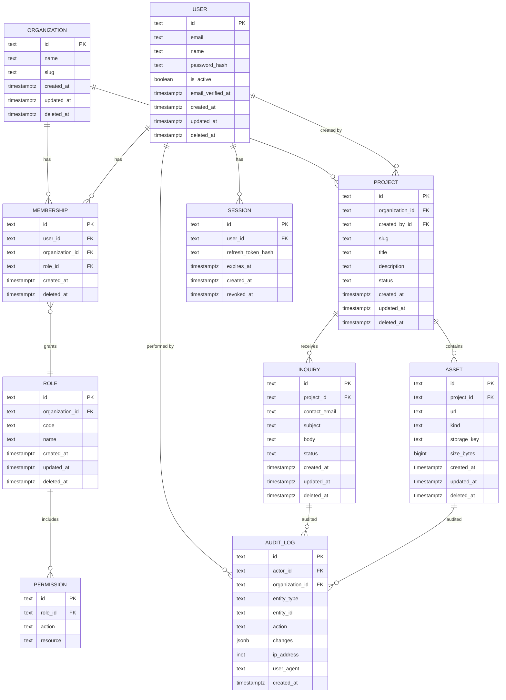
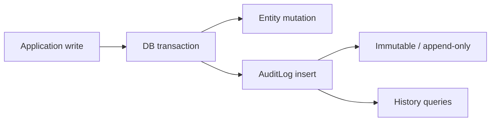

# Creative Digital Company — Database Architecture

- **Document type:** Database architecture (PostgreSQL + Prisma ORM)
- **Author:** CTO (Founding Engineer)
- **Version:** 1.0
- **Status:** Draft for board review
- **Date:** 2026-08-02
- **Companion docs:** [Technology Strategy](/CRE/issues/CRE-6#document-technology-strategy),
  [System Architecture](/CRE/issues/CRE-6#document-system-architecture)
- **Adoption trigger:** persistent data requirement (Roadmap M5; TDR-006). The schema below is the
  target for our first database-backed product.

---

## 0. Overview

This document defines a **production-grade PostgreSQL** schema for the first database-backed
product, expressed in **Prisma ORM conventions** (`schema.prisma` model style). It is designed for:

- Multi-tenant readiness from day one (`Organization` → `User` membership) without forcing
  multi-tenancy on single-tenant deployments.
- Row-level-security-friendly structure (RLS per the System Architecture).
- Full audit trail and soft-delete semantics for every business entity.
- Prisma-native conventions: `String @id @default(cuid())` PKs, `camelCase` fields mapped to
  `snake_case` columns, `@relation` for FKs, `@@unique`, `@@index`, `@updatedAt`, and Prisma
  `extension`-based soft-delete (compatible with Prisma 5/6).

No application code is written in this document; it is schema + design only.

---

## 1. ER Diagram



---

## 2. Prisma schema (`schema.prisma` style)

The following is the canonical schema definition using Prisma ORM conventions.

```prisma
generator client {
  provider = "prisma-client-js"
}

datasource db {
  provider = "postgresql"
  url      = env("DATABASE_URL")
}

// ---------------------------------------------------------------------------
// Identity & tenancy
// ---------------------------------------------------------------------------

model Organization {
  id           String       @id @default(cuid()) @db.VarChar(30)
  name         String
  slug         String       @unique
  memberships  Membership[]
  projects     Project[]
  auditLogs    AuditLog[]

  createdAt DateTime @default(now()) @map("created_at")
  updatedAt DateTime @updatedAt @map("updated_at")
  deletedAt DateTime? @map("deleted_at")

  @@index([deletedAt])
  @@map("organizations")
}

model User {
  id              String      @id @default(cuid()) @db.VarChar(30)
  email           String      @unique
  name            String?
  passwordHash    String?     @map("password_hash")
  isActive        Boolean     @default(true) @map("is_active")
  emailVerifiedAt DateTime?   @map("email_verified_at")
  memberships     Membership[]
  sessions        Session[]
  createdProjects Project[]   @relation("ProjectCreator")
  auditLogs       AuditLog[]  @relation("AuditActor")

  createdAt DateTime @default(now()) @map("created_at")
  updatedAt DateTime @updatedAt @map("updated_at")
  deletedAt DateTime? @map("deleted_at")

  @@index([deletedAt])
  @@map("users")
}

model Membership {
  id             String       @id @default(cuid()) @db.VarChar(30)
  user           User         @relation(fields: [userId], references: [id], onDelete: Cascade)
  organization   Organization @relation(fields: [organizationId], references: [id], onDelete: Cascade)
  role           Role         @relation(fields: [roleId], references: [id])

  userId         String       @map("user_id")
  organizationId String       @map("organization_id")
  roleId         String       @map("role_id")

  createdAt DateTime @default(now()) @map("created_at")
  deletedAt DateTime? @map("deleted_at")

  @@unique([userId, organizationId])
  @@index([organizationId])
  @@index([roleId])
  @@map("memberships")
}

model Role {
  id             String       @id @default(cuid()) @db.VarChar(30)
  organization   Organization @relation(fields: [organizationId], references: [id], onDelete: Cascade)
  code           String
  name           String
  memberships    Membership[]
  permissions    Permission[]

  organizationId String       @map("organization_id")

  createdAt DateTime @default(now()) @map("created_at")
  updatedAt DateTime @updatedAt @map("updated_at")
  deletedAt DateTime? @map("deleted_at")

  @@unique([organizationId, code])
  @@index([deletedAt])
  @@map("roles")
}

model Permission {
  id         String @id @default(cuid()) @db.VarChar(30)
  role       Role   @relation(fields: [roleId], references: [id], onDelete: Cascade)
  action     String // e.g. "project.read", "project.write", "admin"
  resource   String // e.g. "project", "asset", "*"

  roleId     String @map("role_id")

  @@unique([roleId, action, resource])
  @@map("permissions")
}

// ---------------------------------------------------------------------------
// Domain entities
// ---------------------------------------------------------------------------

model Project {
  id             String       @id @default(cuid()) @db.VarChar(30)
  organization   Organization @relation(fields: [organizationId], references: [id], onDelete: Cascade)
  createdBy      User?        @relation("ProjectCreator", fields: [createdById], references: [id], onDelete: SetNull)
  slug           String
  title          String
  description    String?
  status         String       @default("draft") // draft | active | archived
  assets         Asset[]
  inquiries      Inquiry[]

  organizationId String       @map("organization_id")
  createdById    String?      @map("created_by_id")

  createdAt DateTime @default(now()) @map("created_at")
  updatedAt DateTime @updatedAt @map("updated_at")
  deletedAt DateTime? @map("deleted_at")

  @@unique([organizationId, slug])
  @@index([status])
  @@index([deletedAt])
  @@index([createdById])
  @@map("projects")
}

model Asset {
  id         String   @id @default(cuid()) @db.VarChar(30)
  project    Project  @relation(fields: [projectId], references: [id], onDelete: Cascade)
  url        String
  kind       String   @default("image") // image | video | document | other
  storageKey String   @map("storage_key")
  sizeBytes  BigInt   @default(0) @map("size_bytes")

  projectId  String   @map("project_id")

  createdAt DateTime @default(now()) @map("created_at")
  updatedAt DateTime @updatedAt @map("updated_at")
  deletedAt DateTime? @map("deleted_at")

  @@index([projectId])
  @@index([kind])
  @@index([deletedAt])
  @@map("assets")
}

model Inquiry {
  id           String   @id @default(cuid()) @db.VarChar(30)
  project      Project? @relation(fields: [projectId], references: [id], onDelete: SetNull)
  contactEmail String   @map("contact_email")
  subject      String
  body         String
  status       String   @default("new") // new | contacted | closed | spam

  projectId    String?  @map("project_id")

  createdAt DateTime @default(now()) @map("created_at")
  updatedAt DateTime @updatedAt @map("updated_at")
  deletedAt DateTime? @map("deleted_at")

  @@index([status])
  @@index([projectId])
  @@index([createdAt])
  @@index([deletedAt])
  @@map("inquiries")
}

// ---------------------------------------------------------------------------
// Auth sessions
// ---------------------------------------------------------------------------

model Session {
  id                String   @id @default(cuid()) @db.VarChar(30)
  user              User     @relation(fields: [userId], references: [id], onDelete: Cascade)
  refreshTokenHash  String   @map("refresh_token_hash")
  expiresAt         DateTime @map("expires_at")

  userId            String   @map("user_id")

  createdAt DateTime @default(now()) @map("created_at")
  revokedAt DateTime? @map("revoked_at")

  @@index([userId])
  @@index([expiresAt])
  @@map("sessions")
}

// ---------------------------------------------------------------------------
// Audit (append-only)
// ---------------------------------------------------------------------------

model AuditLog {
  id             String       @id @default(cuid()) @db.VarChar(30)
  actor          User?        @relation("AuditActor", fields: [actorId], references: [id], onDelete: SetNull)
  organization   Organization @relation(fields: [organizationId], references: [id])
  entityType     String       @map("entity_type") // "project" | "asset" | "inquiry" | ...
  entityId       String       @map("entity_id")
  action         String       // "create" | "update" | "delete" | "restore" | ...
  changes        Json?        @default("{}") // JSON diff of before/after
  ipAddress      String?      @map("ip_address")
  userAgent      String?      @map("user_agent")

  actorId        String?      @map("actor_id")
  organizationId String       @map("organization_id")

  createdAt      DateTime     @default(now()) @map("created_at")

  @@index([organizationId, entityType, entityId])
  @@index([actorId])
  @@index([createdAt])
  @@map("audit_logs")
}
```

---

## 3. Tables & primary keys

| Table           | Purpose                          | PK type             | Column          |
| --------------- | -------------------------------- | ------------------- | --------------- |
| `organizations` | Multi-tenant root                 | CUID (`VarChar(30)`) | `id`            |
| `users`         | Account identities                | CUID (`VarChar(30)`) | `id`            |
| `memberships`   | User ↔ organization + role        | CUID (`VarChar(30)`) | `id`            |
| `roles`         | Role definitions per org          | CUID (`VarChar(30)`) | `id`            |
| `permissions`   | Role → action/resource grants     | CUID (`VarChar(30)`) | `id`            |
| `projects`      | Primary domain entity             | CUID (`VarChar(30)`) | `id`            |
| `assets`        | Binary/media belonging to project | CUID (`VarChar(30)`) | `id`            |
| `inquiries`     | Lead/inquiry records              | CUID (`VarChar(30)`) | `id`            |
| `sessions`      | Refresh-token sessions            | CUID (`VarChar(30)`) | `id`            |
| `audit_logs`    | Append-only audit trail           | CUID (`VarChar(30)`) | `id`            |

**PK rationale:** Prisma's `cuid()` default is used for all PKs (vs `BigInt serial` or `uuid`).
- CUIDs are URL-safe, sortable, and collision-free at scale; they avoid enumerable IDs and
  auto-increment leak risks.
- `VarChar(30)` matches cuid() length; UUIDs can be adopted later via `@default(uuid())` without
  schema-shape changes if requirements change.

---

## 4. Relationships & foreign keys

| Relationship                    | Type         | FK column            | Referenced          | On delete          |
| ------------------------------- | ------------ | -------------------- | ------------------- | ------------------ |
| Organization → Membership        | 1 : N        | `memberships.organization_id` | `organizations.id`   | `Cascade`           |
| User → Membership                | 1 : N        | `memberships.user_id` | `users.id`           | `Cascade`           |
| Role → Membership                | 1 : N        | `memberships.role_id` | `roles.id`           | `Restrict` (default)|
| Organization → Role              | 1 : N        | `roles.organization_id` | `organizations.id`   | `Cascade`           |
| Role → Permission                | 1 : N        | `permissions.role_id` | `roles.id`           | `Cascade`           |
| Organization → Project           | 1 : N        | `projects.organization_id` | `organizations.id`   | `Cascade`           |
| User → Project (creator)         | 1 : N        | `projects.created_by_id` | `users.id`           | `SetNull`           |
| Project → Asset                  | 1 : N        | `assets.project_id`  | `projects.id`        | `Cascade`           |
| Project → Inquiry                | 1 : N        | `inquiries.project_id` | `projects.id`        | `SetNull`           |
| User → Session                   | 1 : N        | `sessions.user_id`   | `users.id`           | `Cascade`           |
| User → AuditLog (actor)          | 1 : N        | `audit_logs.actor_id` | `users.id`           | `SetNull`           |
| Organization → AuditLog          | 1 : N        | `audit_logs.organization_id` | `organizations.id`   | `Restrict` (default)|

**Rules:**
- **Cascade** for composition (children owned by parent: memberships, permissions, assets, sessions).
- **SetNull** for "keep history" references (creator, audit actor, optional inquiry project).
- **Restrict** (Prisma default) for reference-integrity-critical edges (role membership, org audit log).

---

## 5. Indexes

All composite/selective indexes are declared via `@@index` / `@@unique` in the schema.

| Table            | Index                                              | Type          | Why                                                    |
| ---------------- | -------------------------------------------------- | ------------- | ------------------------------------------------------ |
| `organizations`  | `slug`                                             | UNIQUE        | Tenant lookup by URL slug                              |
| `organizations`  | `deleted_at`                                       | BTREE         | Soft-delete filtering                                  |
| `users`          | `email`                                            | UNIQUE        | Login / uniqueness                                    |
| `users`          | `deleted_at`                                       | BTREE         | Soft-delete filtering                                  |
| `memberships`    | `(user_id, organization_id)`                       | UNIQUE        | One membership per user per org                        |
| `memberships`    | `organization_id`                                  | BTREE         | Org → members query                                    |
| `memberships`    | `role_id`                                          | BTREE         | Role → members query                                   |
| `roles`          | `(organization_id, code)`                          | UNIQUE        | Org-scoped role codes                                  |
| `roles`          | `deleted_at`                                       | BTREE         | Soft-delete filtering                                  |
| `permissions`    | `(role_id, action, resource)`                      | UNIQUE        | No duplicate grants                                    |
| `projects`       | `(organization_id, slug)`                          | UNIQUE        | Org-scoped project slug                                |
| `projects`       | `status`                                           | BTREE         | Status-list queries                                    |
| `projects`       | `deleted_at`                                       | BTREE         | Soft-delete filtering                                  |
| `projects`       | `created_by_id`                                    | BTREE         | "My projects" queries                                  |
| `assets`         | `project_id`                                       | BTREE         | Project → assets                                       |
| `assets`         | `kind`                                             | BTREE         | Media-type queries                                     |
| `assets`         | `deleted_at`                                       | BTREE         | Soft-delete filtering                                  |
| `inquiries`      | `status`                                           | BTREE         | Inbox/status queries                                   |
| `inquiries`      | `project_id`                                       | BTREE         | Project → inquiries                                    |
| `inquiries`      | `created_at`                                       | BTREE         | Date-range inbox queries                               |
| `inquiries`      | `deleted_at`                                       | BTREE         | Soft-delete filtering                                  |
| `sessions`       | `user_id`                                          | BTREE         | Revoke-all-sessions for a user                         |
| `sessions`       | `expires_at`                                       | BTREE         | Cleanup of expired sessions                            |
| `audit_logs`     | `(organization_id, entity_type, entity_id)`        | BTREE         | Entity history lookup                                  |
| `audit_logs`     | `actor_id`                                         | BTREE         | Actor history                                          |
| `audit_logs`     | `created_at`                                       | BTREE         | Time-range audit queries                               |

**Index discipline:** every index earns its place — one per access pattern named in the schema
comments. No speculative indexes; add via migration when a query profile proves the need.

---

## 6. Constraints

### 6.1 Declared in schema (handled by Prisma)
- **NOT NULL** on every required field (implicit in Prisma for non-nullable types).
- **UNIQUE** (`@@unique` / `@unique`): `organizations.slug`, `users.email`,
  `memberships(user_id, organization_id)`, `roles(organization_id, code)`,
  `permissions(role_id, action, resource)`, `projects(organization_id, slug)`.
- **Foreign keys** (see §4) with explicit `onDelete` behavior.
- **Check-style domain constraints** via status defaults + application validation:
  `Project.status ∈ {draft, active, archived}`, `Inquiry.status ∈ {new, contacted, closed, spam}`,
  `Asset.kind ∈ {image, video, document, other}`. Enforce as Postgres `CHECK` constraints in the
  migration (recommended) and validate at the application layer.

### 6.2 CHECK constraints (Postgres migration additions)
```sql
ALTER TABLE projects
  ADD CONSTRAINT projects_status_check
  CHECK (status IN ('draft', 'active', 'archived'));

ALTER TABLE inquiries
  ADD CONSTRAINT inquiries_status_check
  CHECK (status IN ('new', 'contacted', 'closed', 'spam'));

ALTER TABLE assets
  ADD CONSTRAINT assets_kind_check
  CHECK (kind IN ('image', 'video', 'document', 'other'));

ALTER TABLE users
  ADD CONSTRAINT users_email_format_check
  CHECK (email ~* '^[^@\s]+@[^@\s]+\.[^@\s]+$');
```

### 6.3 Soft-delete constraint pattern
- `deleted_at` is nullable (`DateTime?`); a row is "live" when `deleted_at IS NULL`.
- **Partial unique indexes** (Postgres) keep soft-deleted rows from colliding with live rows where
  `@@unique` would otherwise block reuse. Add in the migration:
  ```sql
  CREATE UNIQUE INDEX memberships_active_user_org_uidx
    ON memberships(user_id, organization_id)
    WHERE deleted_at IS NULL;

  CREATE UNIQUE INDEX projects_active_org_slug_uidx
    ON projects(organization_id, slug)
    WHERE deleted_at IS NULL;

  CREATE UNIQUE INDEX roles_active_org_code_uidx
    ON roles(organization_id, code)
    WHERE deleted_at IS NULL;
  ```
  The Prisma `@@unique` columns above remain as the *complete* uniqueness (including deleted rows)
  for data-integrity; the partial indexes enforce *active-record* uniqueness.

---

## 7. Audit tables

**Design principle:** `audit_logs` is **append-only** — no UPDATE, no DELETE, no soft delete.



- **Trigger point:** every business write (`create`, `update`, `delete`, `restore`) inserts one
  `AuditLog` row in the same transaction.
- **Granularity:** per-entity-row, not per-field-per-write; `changes` JSONB stores the
  before/after diff (`{ "before": {...}, "after": {...} }`) for traceability.
- **Fields:** actor (nullable — system actions have no actor), organization, `entity_type` +
  `entity_id` (polymorphic), `action`, `changes`, `ip_address`, `user_agent`, `created_at`.
- **Privacy:** never log passwords, tokens, refresh-token hashes, or full bodies of sensitive
  fields; redact at write time.
- **Retention:** managed retention job archives rows older than policy (e.g., 90 days to cold
  storage / 7 years per policy) — enforced at the DB or archive layer, never by DELETE on the table.
- **RLS:** readable only by admins/auditors of the owning organization.

---

## 8. Soft delete strategy

**Decision:** business entities (`organizations`, `users`, `roles`, `projects`, `assets`,
`inquiries`, `memberships`) use **soft delete** (`deleted_at`). `sessions` and `audit_logs` are
exceptions: sessions are hard-deleted on revoke/expiry; audit logs are never deleted.

### 8.1 Conventions (Prisma extension pattern)
```prisma
// Client-side soft-delete guard (implemented as a Prisma client extension at app bootstrap)
model User {
  // ... fields as above
  deletedAt DateTime? @map("deleted_at")
}
```

- **Field convention:** `deletedAt DateTime? @map("deleted_at")` on every soft-deletable model.
- **Reads:** application queries always filter `deletedAt: null` (via a Prisma client extension
  that injects the filter on `findMany`/`findFirst`/`findUnique` unless `includeDeleted` is set).
- **Deletes:** `delete` is intercepted and rewritten to `update` setting `deletedAt = now()`.
- **Restore:** explicit `restore` operation sets `deletedAt = null`.
- **Hard delete** is reserved for: cascades at the DB level (e.g., `permissions` when a `role` is
  hard-deleted), purge jobs, and legal/retention operations.

### 8.2 Why soft delete
- Auditability: soft-deleted rows remain available for `AuditLog` joins and dispute resolution.
- Safety: accidental deletes are reversible without point-in-time recovery.
- Referential stability: `SetNull`/history references (audit actor, creator) never dangle.

### 8.3 Why not soft-delete everything
- High-churn, low-value rows (`sessions`, ephemeral caches) are hard-deleted to bound table size.
- Audit logs are immutable by design (a "delete" is itself an auditable event, written as a new row).

### 8.4 Purging
- A scheduled job hard-deletes rows where `deleted_at < now() - retention_period` after the audit
  window closes; each purge is itself audited.

---

## 9. Conventions & naming

| Concern        | Convention                                                |
| -------------- | --------------------------------------------------------- |
| Field naming   | Prisma `camelCase`; mapped to Postgres `snake_case` via `@map` / `@@map` |
| Timestamps     | `created_at`, `updated_at`, `deleted_at` on business tables |
| PK             | `String @id @default(cuid()) @db.VarChar(30)`              |
| FK naming      | `<entity>_id` (e.g., `project_id`, `organization_id`)      |
| Boolean        | `is_` prefix (`is_active`, `is_deleted` not needed — use `deleted_at`) |
| Status columns | `status` with enum-like `CHECK` + app-level validation     |
| Enums          | Postgres `CREATE TYPE` enums for stable enum columns (optional; CHECK is Prisma-migration friendly) |
| Soft delete    | `deleted_at DateTime?` + client extension filter           |
| Migrations     | Prisma Migrate; every schema change is a committed migration |

---

## 10. Production-hardening checklist

- [ ] `DATABASE_URL` only in hosting secrets; never in source.
- [ ] TLS for all connections; `sslmode=require`.
- [ ] Row-level security enabled on every tenant table (Postgres `POLICY`), keyed on
      `organization_id`.
- [ ] PITR + scheduled backups (provider-managed); restore drill tested.
- [ ] Connection pooling (e.g., Supabase pooler / PgBouncer) for serverless functions.
- [ ] Parameterized queries only (Prisma does this by default — no raw interpolation).
- [ ] Least-privilege DB roles: app role lacks DDL; migrations use a separate role.
- [ ] Migration on deploy, not ad-hoc; reversible where possible.
- [ ] `CHECK` constraints for every enum-like column.
- [ ] Partial unique indexes for soft-delete-enabled unique fields.

---

## 11. Next action

Board review/adoption of this database design. On approval, the CTO will:
1. Land this schema as the first committed Prisma migration (Roadmap M5) when a product need is
   confirmed.
2. Implement the soft-delete client extension and RLS policies alongside the schema.
3. Wire `audit_logs` insertion into the write path of the serverless API (System Architecture §4/§10).
