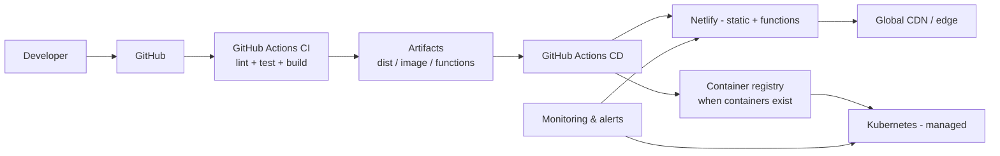
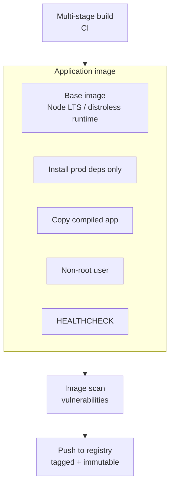
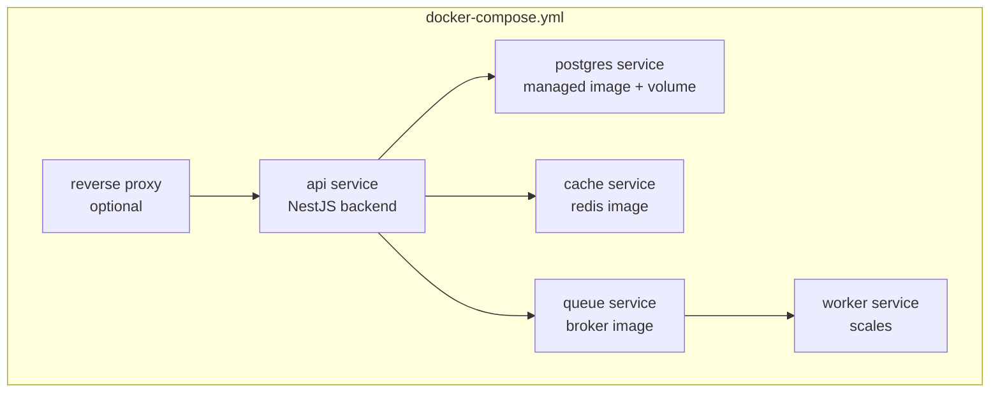
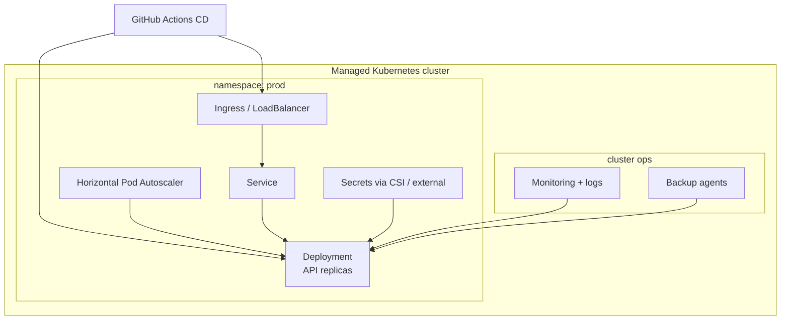
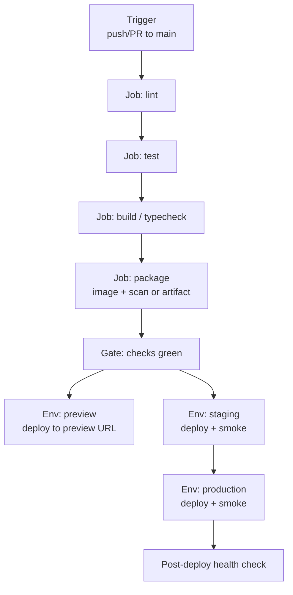
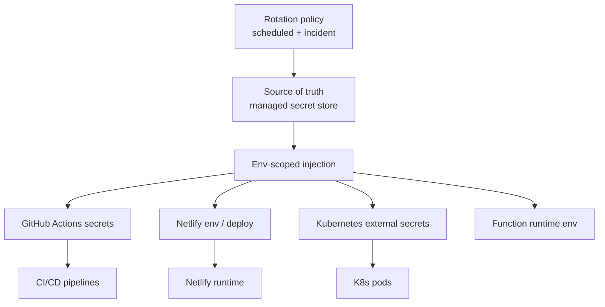
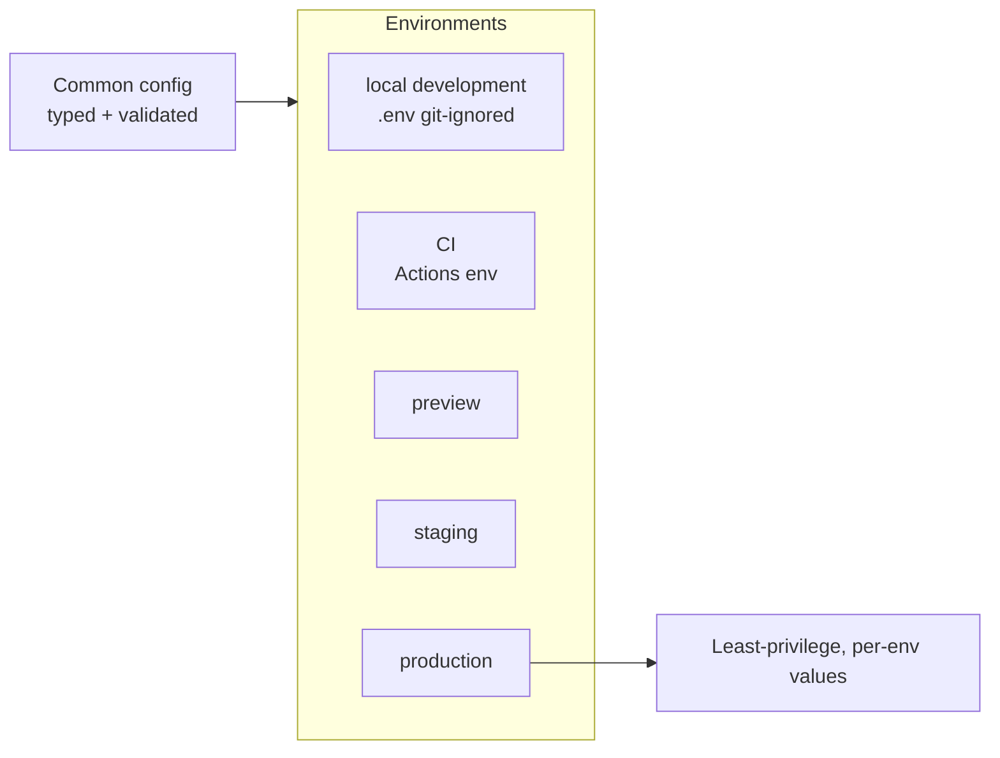
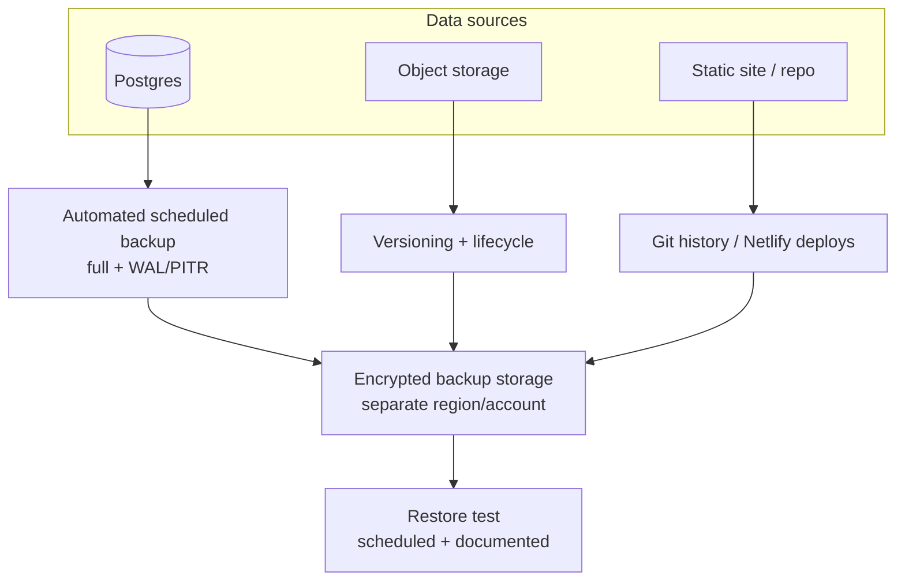
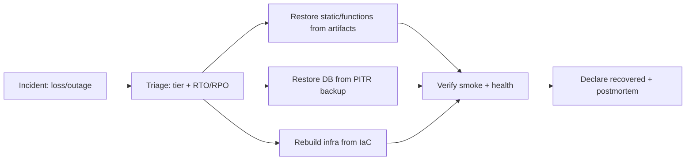
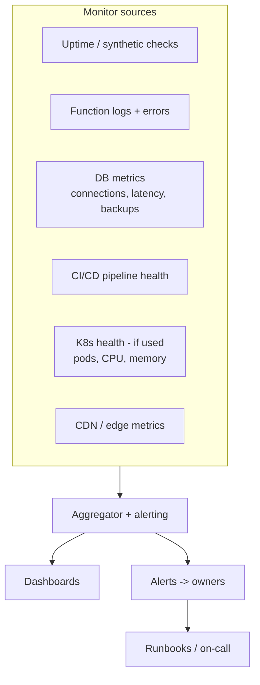

# Creative Digital Company — DevOps Architecture

- **Document type:** DevOps architecture
- **Author:** CTO (Founding Engineer)
- **Version:** 1.0
- **Status:** Draft for board review
- **Date:** 2026-08-02
- **Companion docs:** [Technology Strategy](/CRE/issues/CRE-6#document-technology-strategy),
  [System Architecture](/CRE/issues/CRE-6#document-system-architecture),
  [Roadmap](/CRE/issues/CRE-6#document-roadmap)
- **Philosophy:** **serverless-first, containers-when-needed.** We keep the static site and
  serverless functions on Netlify/GitHub Actions (no containers today). Docker/Compose/K8s are
  adopted only when a workload requires a long-running or custom-runtime service (Roadmap M5+).

---

## 0. Overview

The DevOps architecture covers the full delivery and operations lifecycle:

- **Today:** static site + serverless functions → GitHub Actions CI/CD → Netlify CDN. No containers.
- **Target (when needed):** containerized services (Docker) orchestrated with Docker Compose for
  local/dev and Kubernetes (managed, e.g., AWS EKS / GCP GKE) for production-scale workloads.
- Cross-cutting: secrets management, environment variables, backup strategy, disaster recovery, and
  infrastructure monitoring apply to every layer from day one.

> **No implementation code included.** This document defines topology, practices, and responsibilities.

---

## 1. Delivery pipeline topology

**Principle:** a single source of truth (GitHub) drives one CI pipeline; deployment targets depend
on artifact type. Static/functions → Netlify; containers → registry → Kubernetes.

---

## 2. Docker

**Purpose:** reproducible runtime for containerizable services (backend, workers, AI jobs) —
**not** used for the static site or simple serverless functions (that would add cost/complexity for
no benefit).

**Conventions:**
- **Multi-stage builds:** build stage (toolchain) → runtime stage (deps + distroless base).
- **Immutable tags:** images tagged with commit SHA; `latest` is a pointer only, never deployed by
  itself.
- **Non-root** runtime user; no shell in production image where avoidable.
- **HEALTHCHECK** built into the image.
- **Scanning** (e.g., Trivy) runs in CI before any image is promoted.
- Image purpose: backend API (NestJS), background workers, batch/AI jobs.

---

## 3. Docker Compose

**Purpose:** local development and ephemeral environments — the fastest way to run the full stack
(API + DB + cache + queue) on a laptop or in a preview environment.

**Conventions:**
- **Profiles:** `compose up` boots the whole stack; profile `--profile dev` excludes production-only
  replicas.
- **Named volumes** for DB/cache persistence; never data in the container layer.
- **Secrets for local:** `.env` (git-ignored) + a checked-in `.env.example`.
- **Compose is for dev/CI/ephemeral only** — never the production orchestrator.
- Healthchecks + dependency ordering (`depends_on` with condition).

---

## 4. Kubernetes

**Purpose:** production orchestration for containerized workloads **only when they exist** (managed
Kubernetes — e.g., EKS/GKE). The static site and serverless functions never touch K8s.

**Conventions:**
- **Infrastructure as Code:** cluster manifests (kustomize/Helm) committed; no kubectl drift.
- **Declarative:** Deployments, Services, Ingress; replicas managed by HPA.
- **Namespaces:** `prod`, `staging`; network policies restrict traffic.
- **Secrets:** not in manifests — external secrets (see §7).
- **Rolling updates** with readiness gates; **rollback** via previous revision.
- **Resource limits** on every pod; requests/limits set explicitly.
- Adoption gate: only when a workload cannot be served serverlessly (long-running, custom runtime,
  high sustained concurrency).

---

## 5. GitHub Actions — CI/CD

**Today:** `ci.yml` (lint + test + build on Node 22/24) and `deploy.yml` (build → Netlify deploy).
**Target:** one reusable workflow matrix driving all environments.

**Conventions:**
- **Reusable workflows** (`.github/workflows/`) with matrix for Node versions; callable workflows
  shared across repos.
- **Environment protection:** production deploy requires approval + passing checks; environments
  (`production`) gate secrets.
- **Artifacts** uploaded (dist, image digests, SBOM) and attestations recorded.
- **Cache:** npm/package caches to keep CI fast.
- **No secrets in logs;** redaction on.
- **Smoke post-deploy:** HTTP + content check against the live/preview URL (mirrors the repo's smoke
  tests).

---

## 6. CI/CD strategy

| Stage        | Trigger            | Actions                                        | Target              |
| ------------ | ------------------ | ---------------------------------------------- | ------------------- |
| CI           | PR / push          | lint, test, build, typecheck, format-check     | —                   |
| Package      | CI green           | build artifact / image, scan, tag              | Registry / artifacts |
| Preview      | PR                | deploy to ephemeral/preview URL                | Netlify preview     |
| Staging      | push to main       | deploy staging, run smoke                      | Staging env         |
| Production   | push to main (approved) | deploy production, smoke, health check     | Netlify / K8s       |
| Rollback     | on failure         | redeploy previous known-good release           | Any target          |

**Principles:**
- **Single pipeline** across environments; only the target differs.
- **Promotion, not rebuild:** the exact artifact validated in CI is what deploys.
- **Deploy at will:** trunk-based, `main` is always deployable (Roadmap §8).
- **Separate secrets per environment**; production secrets never used in CI-only/preview contexts.

---

## 7. Secrets management

**Conventions:**
- **Never in source**: no secrets in repo, `.env`, manifests, or images.
- **Layers:** GitHub Actions **secrets** (CI), Netlify **environment variables** (hosting), external
  secrets for K8s (e.g., cloud secret manager via CSI driver).
- **Least privilege:** per-repo/per-env scoping; dedicated deploy tokens; no shared master tokens.
- **Rotation:** scheduled rotation + immediate rotation on any suspected leak; tokens are
  short-lived where possible.
- **Audit:** every secret access/rotation logged; approvals for new external integrations.
- **Examples in repo** are placeholders only (`.env.example`), never real values.

---

## 8. Environment variables

**Conventions:**
- **Schema-validated** at startup (backend ConfigModule / frontend env validation) — fail fast.
- **`NEXT_PUBLIC_*`** only for values safe to expose (frontend); everything else server-side only.
- **Naming:** `SCREAMING_SNAKE_CASE`, grouped by domain (`DB_URL`, `AUTH_JWT_SECRET`,
  `AI_API_KEY`).
- **Defaults** documented in `.env.example`; no secrets in defaults.
- **Promotion:** env maps are part of IaC/release manifests, not ad-hoc UI edits.
- **Drift detection:** a check compares declared vs applied env per environment.

---

## 9. Backup strategy

**Conventions:**
- **Database:** provider-managed backups with **point-in-time recovery (PITR)**; retention matches
  policy (e.g., 7 days daily + 4 weekly); encrypted at rest and in transit.
- **Object storage:** versioning enabled; lifecycle rules to cold/archive tiers.
- **Code/static:** Git history is the backup; Netlify deploys are immutable and rollback-able.
- **Config/IaC:** all manifests/config in Git — the cluster can be rebuilt from code.
- **Encryption:** backups encrypted; restore keys separate from app keys.
- **Restore drill:** a documented, tested restore at least quarterly (or per policy).

---

## 10. Disaster recovery

**Objectives:** define RPO (Recovery Point Objective) and RTO (Recovery Time Objective) per tier.

| Tier            | Example failure        | RPO          | RTO            | Strategy                         |
| --------------- | ---------------------- | ------------ | -------------- | -------------------------------- |
| Static site     | CDN/provider outage    | 0 (immutable)| minutes        | Netlify rollback / redeploy from Git |
| Functions       | Runtime region issue   | 0            | minutes        | Redeploy from artifacts          |
| Database        | Region/instance loss   | ≤ PITR window| < 1 hour       | Restore from PITR in another region |
| Containers (if any) | Cluster loss      | ≤ last backup| < 1 hour       | Rebuild cluster from IaC + restore data |

**Conventions:**
- **Runbooks** per tier: steps, owners, expected RTO, escalation path.
- **Redundancy:** backups in a separate region/account from production.
- **Practice:** tabletop + one real restore exercise per quarter (or per policy).
- **Communication:** incident channel, status page, and postmortem template.
- **Dependency on providers** is accepted and documented; multi-cloud is not a default (cost/complexity).

---

## 11. Infrastructure monitoring

**Conventions:**
- **Everything has an owner and a runbook**; no alert without an action.
- **Tiered:** L1 availability (uptime + CI/CD status) → L2 runtime (logs, errors, DB) → L3
  infrastructure (cluster, capacity).
- **Logs structured** (JSON, `requestId`) and aggregated; no PII/secrets in logs.
- **Metrics to alert on:** site availability, deploy failures, DB connections/backups, function
  error rate/p95 latency, (if K8s) pod restarts + CPU/memory near limits.
- **Dashboards** per environment; a single overview dashboard for the whole estate.
- **Synthetic checks** hit key URLs/flows from multiple regions.
- On-call rotation documented once traffic/complexity justifies it (Roadmap M6).

---

## 12. Layer adoption matrix

| Layer | Today (static-first) | With functions (M4/M5) | With containers (M5+) | Production launch (M8) |
| ----- | -------------------- | ---------------------- | --------------------- | ---------------------- |
| Docker | — | optional for dev parity | required | required (if containers) |
| Compose | dev-only (if API exists) | dev/CI | dev/CI | dev only |
| Kubernetes | — | — | managed, prod only | managed, prod only |
| GitHub Actions | ✅ CI + CD to Netlify | ✅ + preview/staging | ✅ + image build/scan | ✅ full matrix |
| Secrets | GitHub/Netlify env | + env-scoped per env | + external secrets | audited, rotated |
| Env vars | ✅ schema-validated | ✅ per env | ✅ per env via IaC | drift-checked |
| Backups | Git + immutable deploys | + PITR for DB | + cluster-state | restore drill |
| DR | rollback + redeploy | + cross-region DB | + IaC rebuild | exercised |
| Monitoring | uptime + CI status | + logs/errors/DB | + cluster metrics | full tiering |

---

## 13. Production-hardening checklist (DevOps)

- [ ] CI enforces lint/test/build/format; no bypass.
- [ ] Production deploys require approval; previews automatic.
- [ ] Secrets only in env-scoped stores; rotation + audit configured.
- [ ] Env vars schema-validated and drift-checked.
- [ ] DB backups + PITR enabled; restore drill documented and passed.
- [ ] Runbooks exist for each tier with RTO/RPO and owners.
- [ ] Uptime + deploy health monitoring active; alerts have runbooks.
- [ ] Container images (when used): non-root, scanned, immutable tags.
- [ ] IaC committed; no manual cluster/config drift.
- [ ] Post-deploy smoke checks run in every environment.

---

## 14. Next action

Board review/adoption of this DevOps architecture. On approval, the CTO will:
1. Extend the existing GitHub Actions workflows with preview/staging environments + post-deploy
   smoke checks (Roadmap M6).
2. Add backup/PITR + restore-runbook for Postgres when the first DB lands (M5).
3. Adopt Docker/Compose for local backend dev and evaluate managed Kubernetes only when a
   containerized workload is confirmed.
