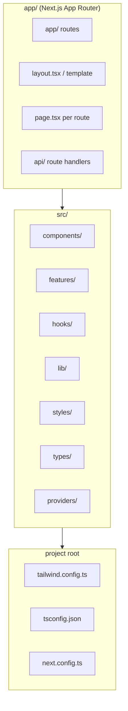
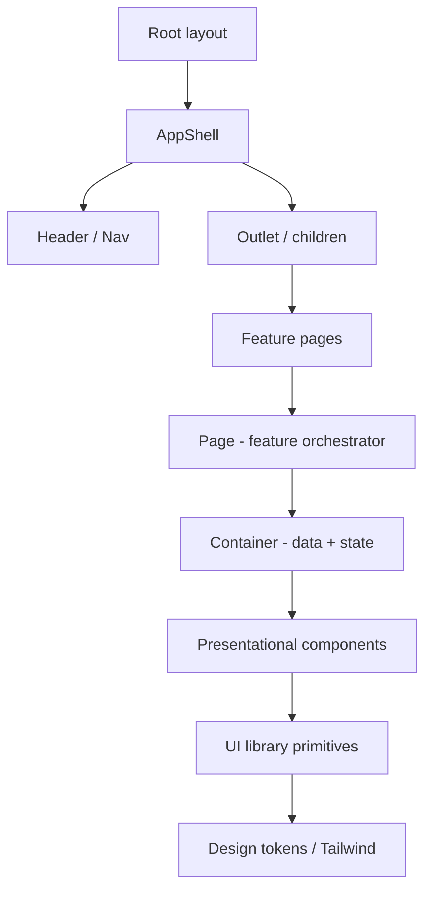
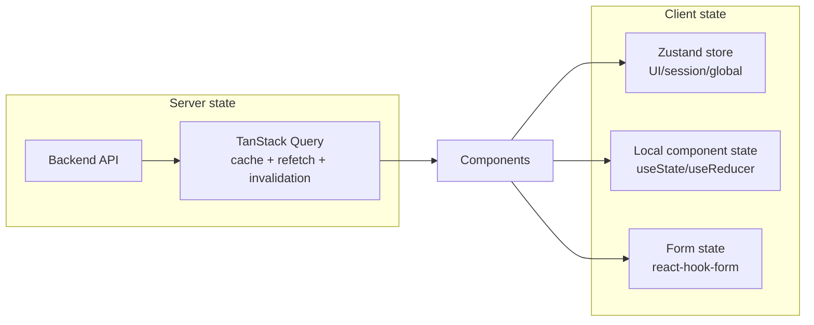
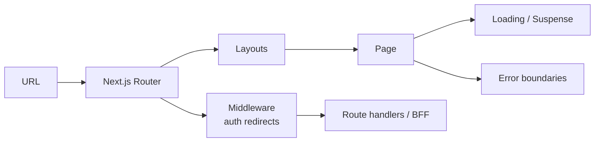
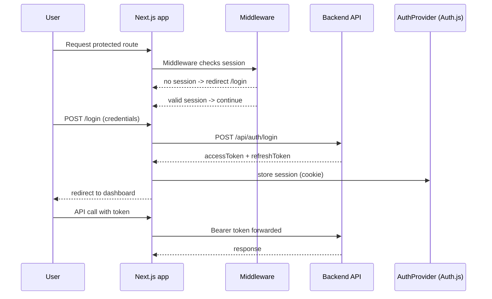
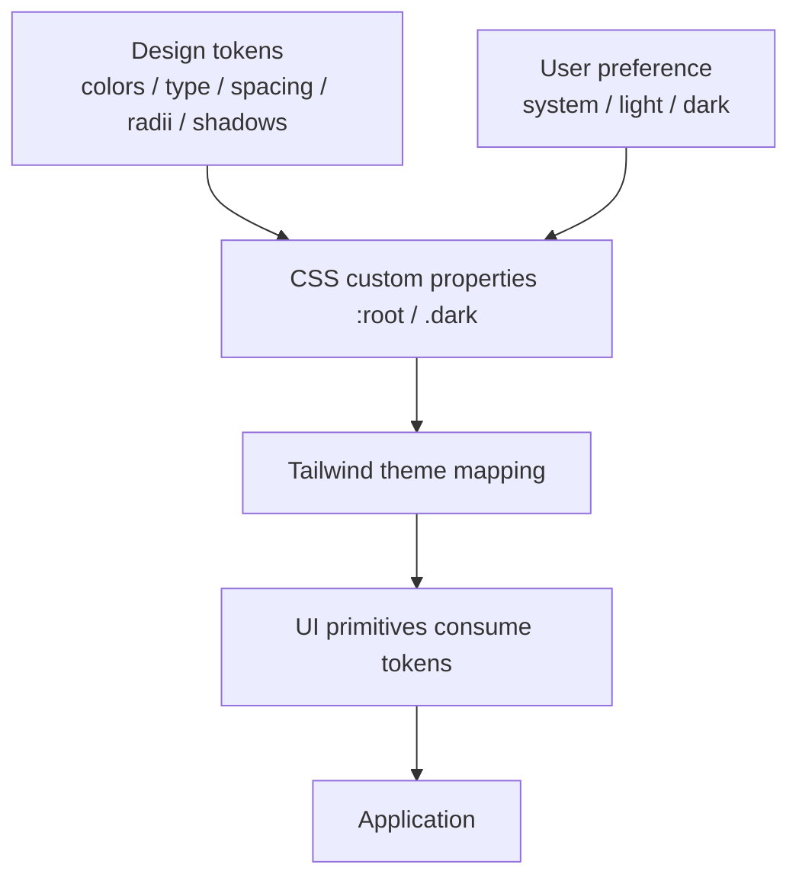
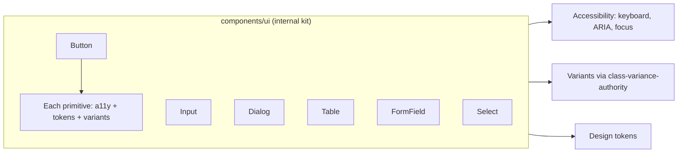
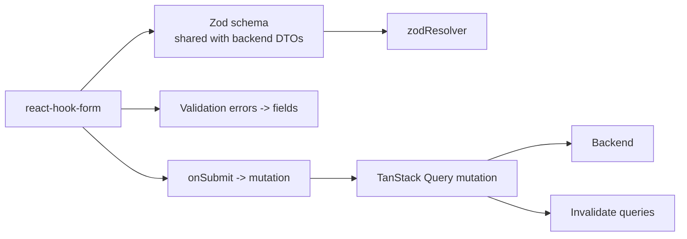
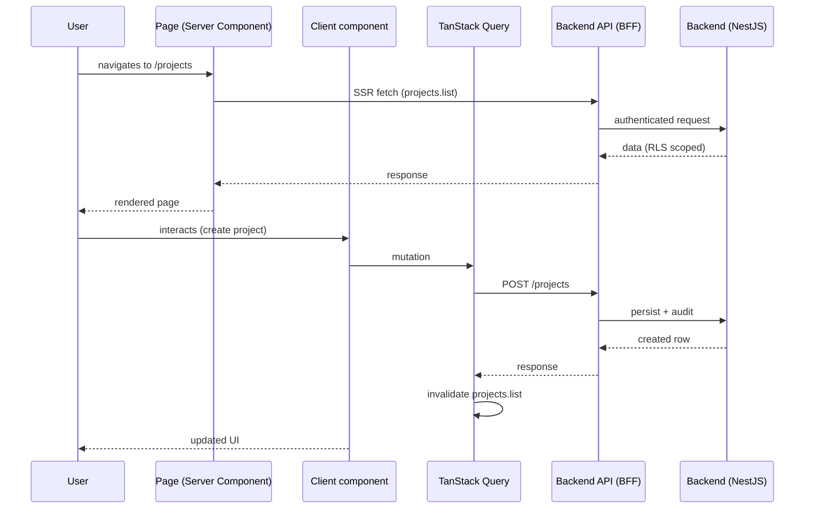

# Creative Digital Company — Frontend Architecture

- **Document type:** Frontend architecture (product applications)
- **Author:** CTO (Founding Engineer)
- **Version:** 1.0
- **Status:** Draft for board review
- **Date:** 2026-08-02
- **Companion docs:** [Technology Strategy](/CRE/issues/CRE-6#document-technology-strategy),
  [System Architecture](/CRE/issues/CRE-6#document-system-architecture),
  [Backend Architecture](/CRE/issues/CRE-6#document-backend-architecture)
- **Scope:** This architecture applies to **interactive product applications** (Roadmap M4+), not the
  static marketing site, which intentionally stays Vite + vanilla JS (TDR-001). Adopting it for a
  product app is a board-directed evolution of TDR-001 for application work.

---

## 0. Overview

Product applications are built with **Next.js (App Router) + React + TypeScript + Tailwind CSS**.
Next.js gives file-based routing, SSR/SSG/ISR, and edge deployment; TypeScript provides type safety
across the boundary with the [Backend Architecture](/CRE/issues/CRE-6#document-backend-architecture)
API; Tailwind provides consistent utility-driven styling that composes with our design tokens.

> **No implementation code is included.** This document defines structure, hierarchy, state,
> routing, auth, theming, UI library, forms, and error handling.

---

## 1. Folder structure

**Feature-first structure** (mirrors the backend module split so front/back concepts line up):



**Concrete layout:**

```
app/                        # Next.js App Router (routes + layouts)
  (public)/                 # marketing-adjacent public pages
    page.tsx
  (app)/                    # authenticated product area
    dashboard/
      page.tsx
    projects/
      [id]/
        page.tsx
  api/                      # server route handlers (BFF boundary)
    auth/
      [...nextauth]/route.ts
  layout.tsx
  globals.css
src/
  components/               # shared, presentational (no business state)
    ui/                     # reusable UI library primitives
    layout/                 # shell: header, footer, nav
  features/                 # feature-scoped: pages, hooks, api, components
    auth/
    projects/
    inquiries/
    ai/
  hooks/                    # shared hooks (useTheme, useMedia, ...)
  lib/                      # pure helpers, API client, query keys
  styles/                   # design tokens, global CSS
  types/                    # shared TS types / API DTO shapes
  providers/                # app-wide providers (theme, query, auth)
```

**Rules:**
- `app/` holds routes only; all logic lives in `src/`.
- `features/` is the unit of vertical slicing — a feature owns its components, hooks, and data.
- `components/ui` is the only place primitives are defined; features compose them.

---

## 2. Component hierarchy



**Layer rules:**
1. **Pages (`page.tsx`)** — thin; define the route's composition and metadata only.
2. **Containers** — connect data (queries/mutations) to presentation; know business state.
3. **Presentational components** — render props/children; no data fetching, no business logic.
4. **UI primitives** (`components/ui`) — pure, accessible, theme-aware atoms (Button, Input,
   Dialog, Table, …).

**Conventions:**
- Props flow down, events flow up (unidirectional).
- Server Components are the default in Next.js; Client Components (`'use client'`) only when
  interactivity/state/hooks require them.
- Reusable markup extracted to primitives; duplication inside a feature is a smell.

---

## 3. State management

**Zustand for client/global state + TanStack Query for server state.**



**Decision matrix:**

| Kind of state            | Mechanism             | Why                                   |
| ------------------------ | --------------------- | ------------------------------------- |
| Server data (projects…)  | TanStack Query        | Caching, stale-while-revalidate, invalidation |
| Mutations                | TanStack Query        | Optimistic updates + rollback         |
| Auth/session + UI prefs  | Zustand               | Small, fast, framework-friendly       |
| Form field state         | react-hook-form       | Perf + validation integration         |
| Ephemeral component UI   | `useState`/`useReducer` | Keep it local                        |

**Rules:**
- Server state is **never** copied into global stores — Query cache is the single source.
- Global stores are small and typed; derive, don't duplicate.
- Query keys follow a convention (`feature.entity.list` / `.detail({id})`) for predictable
  invalidation.

---

## 4. Routing

**Next.js App Router (file-based)** — routes are folders, layouts compose.



**Routing conventions:**
- **Route groups:** `(public)` for public pages, `(app)` for the authenticated product shell —
  each with its own layout.
- **Dynamic routes:** `projects/[id]` for detail pages; `generateMetadata` for SEO.
- **Rendering:** SSG/ISR for public/cacheable content; SSR or client-side fetch for personalized
  data; edge middleware for auth gating.
- **Route handlers** (`app/api/*/route.ts`) act as the BFF: forward to the backend, never call
  third parties directly with secrets.
- **Linking:** typed `<Link>` from next/link; no raw `<a>` for internal navigation.

---

## 5. Authentication flow

**Auth.js (NextAuth) managed by Next.js middleware + backend-issued JWT.**



**Conventions:**
- Tokens issued by the backend (System Architecture §7); NextAuth stores the session securely.
- Middleware redirects unauthenticated users for `(app)` routes; never trusts client-side checks.
- Access token short-lived; refresh handled centrally in the API client.
- `useSession()` in authenticated components; server-side session check on SSR pages.
- Logout invalidates the session and clears client state.

---

## 6. Theme system

**Design tokens + Tailwind + CSS custom properties (light/dark).**



**Conventions:**
- Tokens live once (e.g., `tokens.css`) and map into `tailwind.config.ts` (`colors`,
  `spacing`, `fontFamily`, `borderRadius`).
- Dark mode via class strategy (`.dark`), respecting `prefers-color-scheme` default.
- Theme provider at the root (`providers/theme.tsx`); persistence via localStorage with no-flash
  inline script.
- No hardcoded colors in components — always reference tokens/Tailwind theme keys.
- Spacing/radii/shadow scales match the Database/Site design tokens for brand consistency.

---

## 7. Reusable UI library

**Internal UI kit (`components/ui`) built on accessible primitives — no third-party heavy UI
framework** (aligns with "boring, standards-first" from the Technology Strategy).



**Conventions:**
- Primitives are controlled, typed, and forward refs; support variants/sizes.
- Each primitive ships with accessible semantics (labeling, keyboard, focus trap where needed).
- No inline styling of raw colors; all styling via Tailwind tokens.
- Documented in a local Storybook-style playground only if a component is reused across features
  (avoid docs-drift otherwise).
- Radix UI primitives (headless, accessible) are the allowed foundation for complex widgets;
  a third-party *styled* kit (e.g., MUI/Chakra) is not adopted without a ticket.

---

## 8. Forms

**react-hook-form + Zod validation + TanStack Query mutations.**



**Conventions:**
- Zod schemas are the single source of truth; shared types with the backend where possible.
- Field-level + submit-time validation via `zodResolver`; server errors mapped back to fields.
- Controlled inputs via UI kit `FormField`; async submit disabled during flight.
- Mutation success invalidates related query keys (e.g., after creating a project, invalidate
  `projects.list`).
- Large/complex forms broken into steps with a single top-level schema (multi-step wizard pattern).

---

## 9. Error handling

**Layered: boundaries, loading, fallbacks, and normalized API errors.**

```mermaid
flowchart TB
    subgraph Layers["Error layers"]
        E1[Global error boundary<br/>app/error.tsx]
        E2[Route/segment boundaries<br/>[slug]/error.tsx]
        E3[Component suspense + error fallbacks]
    end
    subgraph Errors["Error sources"]
        S1[Network / API errors]
        S2[Validation errors]
        S3[Auth / 401-403]
        S4[Unexpected runtime errors]
    end
    S1 --> E3
    S2 --> E3
    S3 --> E1
    S4 --> E1
    E3 --> E2
    E2 --> E1
```

**Conventions:**
- **API client** normalizes backend error bodies (Backend Architecture §11) into typed errors;
  never surfaces raw fetch failures.
- **401** → redirect to login; **403** → permission fallback UI; **404** → `notFound()`/`not-found`.
- **Validation errors** render inline on fields (from §8).
- **Runtime errors** bubble to the nearest `error.tsx` boundary with a friendly fallback and a
  retry; errors are logged (correlated by `requestId`).
- **Loading states** are explicit (`loading.tsx`, Suspense) — no blank screens.
- Errors are user-safe: no stack traces or internals exposed.

---

## 10. Data flow (end-to-end)



---

## 11. Conventions summary

| Concern       | Convention                                          |
| ------------- | --------------------------------------------------- |
| Language      | TypeScript (strict mode)                            |
| Framework     | Next.js App Router                                  |
| Styling       | Tailwind CSS over design tokens (no raw colors)     |
| Server state  | TanStack Query                                      |
| Client state  | Zustand (small, typed)                              |
| Forms         | react-hook-form + Zod                               |
| Routing       | File-based App Router, route groups + middleware    |
| Auth          | Auth.js (NextAuth) + backend JWT                    |
| Components    | Server-first; UI primitives in `components/ui`      |
| Errors        | Boundaries + normalized API errors + retry fallbacks |
| Naming        | PascalCase components, camelCase hooks/functions, `kebab-case` files |

---

## 12. Production hardening (frontend checklist)

- [ ] Strict TypeScript; no `any` leaks across feature boundaries.
- [ ] Accessible by default (keyboard, ARIA, focus, contrast) — smoke-tested.
- [ ] Bundle-size budgets on route chunks; code-splitting via App Router.
- [ ] No secrets in client bundles; env separation (`NEXT_PUBLIC_*` only for public values).
- [ ] Middleware auth gating on every `(app)` route; session revalidated server-side.
- [ ] All external calls through the BFF/route handlers — no browser-direct third-party keys.
- [ ] Error/loading states for every route; `not-found` pages.
- [ ] Performance budgets (LCP, CLS) checked in CI or PR review.
- [ ] Design tokens used exclusively; no hardcoded colors/spacing.

---

## 13. Adoption path (ties to roadmap)

| Capability                    | Milestone | Notes                                   |
| ----------------------------- | --------- | --------------------------------------- |
| Next.js + TS + Tailwind scaffold | M4      | First product template (Workstream C)    |
| Design tokens + UI kit        | M3        | Tokens shared with the static site       |
| Auth flow                     | M5        | When gated/private product content lands |
| Server state + forms          | M4/M5     | First interactive product feature        |
| Observability hooks           | M6        | Error logging + performance budgets      |

---

## 14. Next action

Board review/adoption of this frontend architecture. On approval, the CTO will:
1. Scaffold the Next.js product template (structure, Tailwind + tokens, strict TS, lint/CI) as the
   first M4 implementation ticket.
2. Build the initial UI kit primitives against the design tokens.
3. Wire the API client + TanStack Query conventions against the Backend Architecture.
