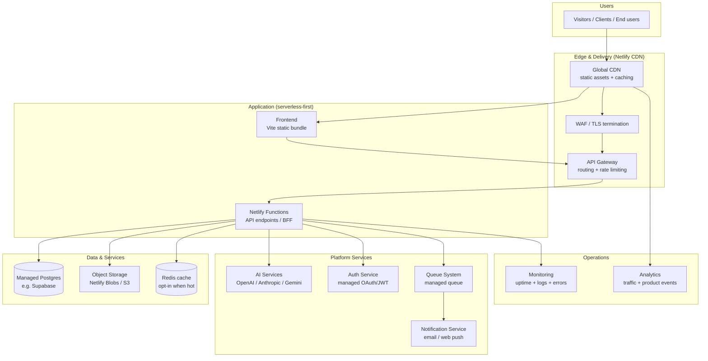

# Creative Digital Company — Master Technical Blueprint

- **Document type:** Official development guide (master blueprint)
- **Author:** CTO (Founding Engineer)
- **Version:** 1.0
- **Status:** Draft for board review
- **Date:** 2026-08-02
- **Role:** Single consolidated reference for the engineering team. Where a topic is covered in
  depth by a companion document, this blueprint summarizes it and links to the full source.

---

## How to use this blueprint

This blueprint is the **entry point** for anyone working on the platform. It consolidates the
Technology Strategy, Roadmap, System Architecture, Database Architecture, Backend Architecture,
Frontend Architecture, API Specification, DevOps Architecture, and Security Architecture into one
operating guide.

**Canonical documents (read for depth):**

| Document | Repo file | Issue doc |
| -------- | --------- | --------- |
| Technology Strategy (+ TDRs) | `TECHNOLOGY_STRATEGY.md` | [technology-strategy](/CRE/issues/CRE-6#document-technology-strategy) |
| Software Development Roadmap | `ROADMAP.md` | [roadmap](/CRE/issues/CRE-6#document-roadmap) |
| System Architecture | `SYSTEM_ARCHITECTURE.md` | [system-architecture](/CRE/issues/CRE-6#document-system-architecture) |
| Database Architecture | `DATABASE_ARCHITECTURE.md` | [database-architecture](/CRE/issues/CRE-6#document-database-architecture) |
| Backend Architecture | `BACKEND_ARCHITECTURE.md` | [backend-architecture](/CRE/issues/CRE-6#document-backend-architecture) |
| Frontend Architecture | `FRONTEND_ARCHITECTURE.md` | [frontend-architecture](/CRE/issues/CRE-6#document-frontend-architecture) |
| API Specification | `API_SPECIFICATION.md` + `openapi.yaml` | [api-specification](/CRE/issues/CRE-6#document-api-specification) |
| DevOps Architecture | `DEVOPS_ARCHITECTURE.md` | [devops-architecture](/CRE/issues/CRE-6#document-devops-architecture) |
| Security Architecture | `SECURITY_ARCHITECTURE.md` | [security-architecture](/CRE/issues/CRE-6#document-security-architecture) |

**Change policy:** minor adjustments (versions, tooling swaps within a documented alternative)
require CTO approval; major changes (framework introduction, hosting migration, new
backend/data/AI platform, committed spend) require a ticket with justification and board approval —
the affected document is updated, never silently deviated from.

---

## 1. Vision & strategy

Creative Digital Company is a design and development studio. The technical foundation must be
**simple, fast, accessible, low-cost, and easy for a small team to operate and extend** — a
founding engineer today, more engineers tomorrow.

The strategy is a **pragmatic, standards-first, JavaScript-centric stack**: a static, accessible
marketing site (live) on Netlify with GitHub + GitHub Actions for CI/CD. Long term we stay
static-first by default, introduce backend + AI capability as products demand it (serverless
functions first, then managed services), and **never adopt a tool without a ticket and a stated
reason.**

### 1.1 Architecture principles

1. **Static-first** — serve what can be static from the CDN; add servers only for real need.
2. **Serverless before servers** — functions scale with demand and cost nothing idle.
3. **Managed over self-hosted** — databases, auth, AI, queues, notifications, observability.
4. **Gateway as the only front door** — no direct service-to-service calls.
5. **Security by default** — TLS, secrets, RLS, least-privilege tokens, no secrets in code.
6. **Observable from day one** — uptime + deploy health now; deeper telemetry when it matters.
7. **Everything as code** — topology, gateway rules, migrations, and workflows live in the repo.
8. **Boring technology wins** — mature, widely-adopted tools with predictable behavior, unless a
   ticket justifies novelty.
9. **Accessibility is not optional** — a11y is a first-class requirement in review and tests.

### 1.2 Current stack (as of this blueprint)

| Layer | Technology | Notes |
| ----- | ---------- | ----- |
| Language | JavaScript (ES modules), Node ≥ 22 (target 24) | `package-lock.json` committed |
| Build | Vite | Dev server + production build |
| Testing | Vitest (+ jsdom), smoke tests on prod build | |
| Lint / format | ESLint v10 (flat) + Prettier | `npm run verify` gate |
| Frontend (site) | Vanilla JS + semantic HTML + CSS (design tokens in `:root`) | No framework (TDR-001) |
| Version control | Git on GitHub (`shakeel121/creative-digital-company`) | Trunk-based, `main` |
| CI/CD | GitHub Actions — `ci.yml` (lint+test+build), `deploy.yml` | |
| Hosting | Netlify (free tier, CDN, HTTPS, previews, rollbacks) | Live: `creative-digital-company.netlify.app` |

**Conditional additions** (adopt with a ticket, see TDR-006/007): Web Components, Netlify
Functions, managed Postgres (e.g., Supabase), Netlify Blobs/S3, Netlify Analytics + structured
logs, managed AI APIs (OpenAI/Anthropic/Gemini).

---

## 2. Roadmap (M0 → M8)

**Summary grid** (full detail in `ROADMAP.md`):

| # | Milestone | Status | Complexity | Depends on |
| - | --------- | ------ | ---------- | ---------- |
| M0 | Technical foundation & team | ✅ Done | M | — |
| M1 | Company website MVP | ✅ Done | S–M | M0 |
| M2 | Hosted remote, CI/CD, deploy | ✅ Done | M | M1 |
| M3 | Branding & design system (B) | 🔄 Next | M–L | M2 |
| M4 | Digital products capability (C) | ⏳ Planned | M–L | M3 |
| M5 | Backend & data layer | ⏳ Conditional | L | M4 + need |
| M6 | Observability & security | ⏳ Planned | M | M2/M5 |
| M7 | Marketing & pre-launch | ⏳ Planned | M | M3/M4 |
| M8 | Production launch & ops | ⏳ Final | M | M6/M7 |

**Sequencing rationale:** M0→M2 are delivered and give a zero-cost, always-deployable baseline.
M3 (brand/design system) precedes M4 so all deliverables are consistent. M4 (product workflow)
precedes M5 — prove static product delivery before paying for a backend. **M5 is deliberately
conditional** (TDR-006): no server before a product need. M6 precedes M8 (don't launch what you
can't observe/roll back); M7 + M6 together gate M8.

**Active milestone:** M3 (branding & design system) is next up. When adopted, the CTO creates
implementation issues for the design-system module, component library, and site rebrand.

---

## 3. System architecture (topology)

**Static-first today, layered target as products land:**



**Key decisions:**
- Static content never touches a server; all dynamic work enters through one gateway into
  serverless functions.
- "Services" are logical, bounded units in a serverless-function BFF — **no microservice fleet**
  for a 1–3 engineer company.
- Platform services (AI, auth, queue, notifications, monitoring, analytics) are **managed**.
- Full adoption path per layer is in `SYSTEM_ARCHITECTURE.md` §15.

---

## 4. Database architecture (PostgreSQL + Prisma)

**Default: managed Postgres. Nothing else until a requirement is proven.** Full schema in
`DATABASE_ARCHITECTURE.md`.

**Core models:** `Organization`, `User`, `Membership`, `Role`, `Permission`, `Project`, `Asset`,
`Inquiry`, `Session`, `AuditLog`.

**Conventions:**
- **CUID PKs** (`String @id @default(cuid()) @db.VarChar(30)`) — URL-safe, sortable, non-enumerable.
- `camelCase` in Prisma → `snake_case` columns via `@map`/`@@map`.
- **Multi-tenant from day one** via `Organization` ↔ `User` membership, with **RLS** keyed on
  `organization_id` as the final authority on data visibility.
- **Soft delete** (`deleted_at DateTime?`) on business entities; sessions hard-deleted on
  revoke/expiry; **audit logs append-only and never deleted**.
- **Audit trail:** every business write inserts an `AuditLog` row **in the same transaction**
  (`actorId`, `organizationId`, `entityType/Id`, `action`, `changes` JSONB diff, `ipAddress`,
  `userAgent`, `createdAt`); redacted (never passwords/tokens); retention 90 days hot → cold/7yr.
- **Indexes earn their place**; `@@unique` + partial unique indexes for soft-delete-enabled unique
  fields; `CHECK` constraints for enum-like status columns.
- **Hardening:** `DATABASE_URL` only in secrets, TLS/`sslmode=require`, PITR + scheduled backups
  + restore drill, connection pooling for serverless, least-privilege roles, migration-on-deploy.

---

## 5. Backend architecture (NestJS + Clean Architecture)

**Adoption trigger: first interactive/server-backed product (Roadmap M5).** Full detail in
`BACKEND_ARCHITECTURE.md`.

- **NestJS** application, **Clean Architecture**: domain core → application (services/use cases) →
  adapters (controllers, repositories, external clients). Dependencies point **inward only**.
- **Feature-first modules:** `core/` (config, auth, logging, common guards/filters/pipes) +
  feature modules (`users`, `projects`, `assets`, `inquiries`, `ai`, `health`, …). One bounded
  responsibility per module.
- **Repositories are the only DB access** (Prisma); they speak in domain entities and centralize
  soft-delete filtering. RLS remains active at the DB.
- **DTOs** (`class` + `class-validator`) for commands, queries, params, and responses; global
  `ValidationPipe` (`whitelist`, `forbidNonWhitelisted`, `transform`).
- **Auth:** `@UseGuards(JwtAuthGuard)` + `@Roles(...)`; short-lived JWT (~15 min), rotating
  refresh tokens stored hashed in `sessions`.
- **Authorization:** RBAC guard (coarse) + RLS (fine-grained, final authority).
- **Errors:** global exception filter → standard body
  `{ statusCode, error, message, path, timestamp, requestId }`; domain errors map to HTTP codes.
- **Logging:** structured JSON (event/level/message/requestId/userId/orgId/durationMs), no
  secrets/PII; correlation via `requestId`.
- **Config:** externalized + validated at startup; secrets only from hosting env.

---

## 6. Frontend architecture (Next.js + React for product apps)

**Scope:** applies to interactive product applications (Roadmap M4+). The static marketing site
**stays Vite + vanilla JS per TDR-001**; adopting Next.js/React for product work is a
board-directed evolution. Full detail in `FRONTEND_ARCHITECTURE.md`.

- **Stack:** Next.js (App Router) + React + TypeScript + Tailwind CSS.
- **Structure (feature-first):** `app/` = routes only; `src/features/<feature>/` vertical slices;
  `src/components/ui/` primitives; `src/lib`, `src/types`, `src/hooks`, `src/providers`,
  `src/styles`.
- **Component hierarchy:** pages → containers → presentational → UI primitives; **server-first**.
- **State:** TanStack Query (server), Zustand (client/global), react-hook-form (forms), local
  `useState`.
- **Routing:** App Router, route groups `(public)/(app)`, middleware auth, **BFF route handlers**.
- **Auth flow:** Auth.js (NextAuth) + backend JWT; middleware gating; token refresh.
- **Theme:** design tokens → Tailwind mapping → CSS custom properties; light/dark.
- **UI library:** internal `components/ui` kit with accessible primitives (Radix allowed);
  token-driven variants.
- **Forms:** react-hook-form + **Zod shared with backend DTOs** + Query mutations.
- **Errors:** layered error boundaries, normalized API errors, 401/403/404 mapping, retry fallbacks.
- **Data flow:** client → BFF route handler → gateway → API → DB, types shared from the OpenAPI
  spec (see §7).

---

## 7. API specification (OpenAPI 3.0.3)

**Single source of truth:** [`openapi.yaml`](https://github.com/shakeel121/creative-digital-company/blob/main/openapi.yaml)
(44 paths, 54 operations, 33 schemas) + summary in `API_SPECIFICATION.md`.

**Domains:** Authentication, Users, Companies, Documents, AI, Payments, Notifications, Admin.

**Conventions:**
- JSON over HTTPS, `camelCase`; `Authorization: Bearer <accessToken>` (JWT); all non-public
  operations declare `bearerAuth`; the only public operation is the signed payment webhook.
- CUID identifiers; pagination envelope `{ data, meta: { page, pageSize, total } }`.
- Standard error body with `requestId`; status usage 400/401/403/404/409/429/402, sanitized 5xx.
- Documents are versioned (revisions) with optimistic concurrency via `baseRevisionId` (409 on
  conflict) and soft delete.
- **Tooling:** backend DTOs generated/verified against these schemas; frontend typed client
  generated (e.g., `openapi-typescript`); Swagger UI/ReDoc render the same YAML; E2E contract tests
  assert response shapes.

**Key flows (Authentication):**
1. `POST /auth/register` → 201 tokens + verification email; `POST /auth/verify-email`.
2. `POST /auth/login` → `{ accessToken, refreshToken, expiresIn, user }`.
3. Refresh: `POST /auth/refresh` (rotation); logout: `POST /auth/logout` revokes the session.
4. Forgot/reset password via signed expiring tokens; uniform responses (no enumeration).

---

## 8. DevOps architecture

**Serverless-first, containers-when-needed.** Full detail in `DEVOPS_ARCHITECTURE.md`.

| Layer | Today | When containers/product apps land |
| ----- | ----- | --------------------------------- |
| CI/CD | GitHub Actions: `ci.yml` + `deploy.yml` (Netlify) | Reusable matrix, preview → staging → prod, post-deploy smoke, rollback |
| Docker | — | Multi-stage builds, immutable SHA tags, non-root, HEALTHCHECK, scanning |
| Compose | — | Local full-stack dev (API + Postgres + Redis + queue + worker); **never prod orchestrator** |
| Kubernetes | — | Managed (EKS/GKE) only when a workload can't be serverless; IaC, namespaces, HPA, external secrets |
| Secrets | GitHub secrets + Netlify env | Env-scoped layers; external secrets for K8s; least privilege, rotation, audit |
| Env vars | Schema-validated | Per-env maps as IaC, drift-checked |
| Backups | Git + immutable deploys | Postgres PITR, object-storage versioning, encrypted, restore drills |
| DR | rollback + redeploy | RPO/RTO per tier, runbooks, cross-region backups, exercises |
| Monitoring | uptime + CI status | Tiered L1/L2/L3, structured logs, dashboards, synthetic checks, on-call |

**Adoption matrix note:** static/functions → Netlify; containers → registry → Kubernetes. Single
pipeline across environments; **promotion, not rebuild** (the exact artifact CI validated is what
deploys).

---

## 9. Security architecture

**Defense in depth, least privilege, zero trust on data, fail closed, assume breach.** Full detail
in `SECURITY_ARCHITECTURE.md`.

| Area | Design |
| ---- | ------ |
| Authentication | email+password (argon2id) + OAuth/OIDC; MFA for privileged roles; email verification; revocable sessions |
| Authorization | JWT guard → RBAC guard → **RLS (final authority)**; re-validated per request |
| RBAC | company roles owner/admin/editor/viewer/billing + platform_admin; immediate revocation |
| Encryption | TLS 1.2+, encrypted at rest/backups, argon2id, hashed refresh tokens, KMS envelope encryption, no custom crypto |
| JWT | asymmetric (RS256/ES256) via JWKS, ~15 min, minimal claims, `jti` |
| Refresh tokens | opaque, single-use, rotated, stored hashed, family revocation on replay, inactivity + absolute caps |
| Rate limiting | edge + app layers, per-IP + per-account, shared store, `429` + Retry-After |
| OWASP Top 10 | full A01–A10 mapping to controls (A01 access control, A03 injection, A06 components, …) |
| SQL injection | repository-only Prisma access, no raw SQL, injection E2E tests + SAST |
| XSS | framework escaping, allowlisted sanitization, CSP (no inline scripts), HttpOnly/SameSite cookies |
| CSRF | bearer-header auth (non-cookie), SameSite cookies, allowlisted CORS, frame-ancestors |
| Audit logs | same-transaction append-only, action/actor/target/changes/requestId, retention, admin query |
| Security headers | HSTS, CSP, `nosniff`, `DENY`/`SAMEORIGIN` frame, referrer/permissions policies — at edge + CI-verified |
| Data privacy | data inventory, minimization, user rights (access/export/delete DSAR), retention + purge, consent, breach runbook |

**Security in CI:** SAST, dependency/container scanning (fail on critical/high), secret scanning
(pre-commit + CI), DAST scheduled, manual pen test before public product launch (M8 gate),
security E2E tests (auth, RBAC/RLS isolation, injection, XSS, rate limit, headers).

---

## 10. Technology Decision Record (TDR) summary

| TDR | Decision | Status |
| --- | -------- | ------ |
| TDR-001 | Vite + vanilla JS for the company site; no framework | ✅ Accepted |
| TDR-002 | Netlify hosting (free tier) | ✅ Accepted |
| TDR-003 | GitHub + GitHub Actions; trunk-based; `main` → CD | ✅ Accepted |
| TDR-004 | Vitest (+ jsdom) testing | ✅ Accepted |
| TDR-005 | ESLint v10 (flat) + Prettier; `npm run check` gate | ✅ Accepted |
| TDR-006 | Netlify Functions first; managed Postgres when data needed | ⏳ Proposed (adopt on first server-side ticket) |
| TDR-007 | Managed AI APIs behind our own functions; keys as secrets | ⏳ Proposed (adopt per feature ticket) |

**Change policy:** any new TDR or reversal of an accepted TDR requires a ticket + justification +
board approval, and the affected document is updated.

---

## 11. Engineering standards & workflow

**Definition of done (every change):**
- `npm run lint`, `npm run test`, `npm run build` all pass (the `npm run verify` gate).
- CI enforces the same steps on Node 22 and 24 for every push/PR; a red CI blocks merge.
- Small, logical commits with imperative messages; commit co-author attribution as required
  (`Co-Authored-By: Paperclip <noreply@paperclip.ing>`).
- UX/marketing-facing changes loop in UX designer / CMO when hired.
- No secrets, credentials, or customer data in the repo — ever.

**Branching (trunk-based):**
- `main` is always deployable; protected (CI + review required).
- Short-lived branches `feat/`, `fix/`, `chore/` merged via PR after CI + review.
- Never push directly to `main`; no long-lived release branches at this stage. Version tags
  (`v0.x.y`) on notable milestones.

**Local workflow:**
```
npm ci          # install from lockfile
npm run dev     # develop
npm run verify  # lint → test → build, before pushing
npm run preview # serve built dist/
```

**Testing pyramid:** smoke/E2E-lite (build + serve + key content + asset graph) → unit/integration
(site structure, asset graph) → feature-level assertions → a11y checks → manual/browser QA with a
reproducible test plan for non-trivial changes. Meaningful assertions over coverage thresholds.

**Deployment:** push to `main` → `ci.yml` → `deploy.yml` → Netlify production. Netlify provides
deploy previews and one-click rollbacks. Manual fallback:
`netlify deploy --prod --dir dist --site <id>`.

---

## 12. Engineering conventions (quick reference)

| Concern | Convention |
| ------- | ---------- |
| Language/style | JavaScript ES modules; Prettier defaults; zero-warning ESLint on merged code |
| HTML | semantic elements, `lang`, viewport, accessible labels, skip-link, focus-visible; anchors resolve to real `id`s |
| CSS | design tokens from `:root`; no hardcoded colors/spacing; responsive + accessible |
| JS | no `console.*` in shipped code; guard DOM queries; never edit `dist/`/`node_modules/` |
| Backend modules | `*.module.ts`, PascalCase; feature-first; one bounded responsibility |
| DTOs | `*.dto.ts` (Create/Update/Query/Response); camelCase wire format |
| Repositories | `*.repository.ts` + `*.repository.port.ts`; only DB access |
| Guards/filters | `*.guard.ts`, `*.filter.ts`, `*.pipe.ts` |
| DB fields | Prisma `camelCase` → Postgres `snake_case`; `deleted_at` for soft delete |
| Enums/status | `SCREAMING_SNAKE` values; DB `CHECK` + app validation |
| IDs | CUID strings, validated (`@IsCuid`) |
| Dependencies | commit `package-lock.json`; no new tool/framework without a ticket + reason |
| Secrets | never in source; hosting env/secrets only; treat any leak as an incident and rotate |

---

## 13. Observability & operations

**Stage 1 (now):** uptime HTTP 200 check on the live URL + CI/deploy run status (a failed deploy
surfaces in CI).

**Stage 2 (traffic/functions/product apps):** Netlify Analytics (privacy-friendly, no cookie
banner), structured function logs, hosted error tracking (e.g., Sentry), synthetic checks on key
flows, and (M6) a documented incident-response runbook with rollback path and on-call owner.

**Rules:** alerts require owners; no alert without a runbook action; logs never contain
secrets/PII; aggregate before alerting; instrumentation is additive and never on the critical path.

---

## 14. Production-hardening checklist (cross-cutting)

- [ ] CI enforces lint/test/build/format; no bypass.
- [ ] Production deploys require approval; previews automatic.
- [ ] Secrets only in env-scoped stores; rotation + audit configured.
- [ ] Env vars schema-validated and drift-checked.
- [ ] DB backups + PITR enabled; restore drill documented and passed.
- [ ] RLS enabled + verified on every tenant table; RBAC coverage on every protected route.
- [ ] Audit insertion in the same transaction as every business write.
- [ ] Security headers at edge + origin; verified in CI.
- [ ] TLS + HSTS everywhere; MFA for privileged roles.
- [ ] No raw SQL; repository-only data access; injection/XSS/CSRF E2E tests.
- [ ] Dependency + secret scanning green in CI; DAST scheduled.
- [ ] Uptime + deploy health monitoring active; runbooks exist with RTO/RPO and owners.
- [ ] Data privacy: inventory, DSAR workflow, retention + purge policy.
- [ ] Container images (when used): non-root, scanned, immutable tags; IaC committed.
- [ ] Post-deploy smoke checks run in every environment.

---

## 15. Next action

Board review/adoption of this master blueprint (and its nine component documents). On approval, the
CTO will proceed in order:

1. Open implementation issues for **M3** (branding & design system) — the design-system module,
   component library, and site rebrand — including UX/CMO hand-offs when those roles are hired.
2. On product need confirmation (M5 trigger), land the backend scaffold (NestJS modules + config +
   global guards/pipes/filters), the first committed Prisma migration (schema + soft-delete +
   RLS + audit wiring), and the first feature module (`documents`) end-to-end against the OpenAPI
   contract with E2E security and contract tests.
3. Extend CI/CD with preview/staging environments + post-deploy smoke checks, and add
   secret-scanning, security-header checks, and dependency scanning to CI (M6 hardening).

---

*This blueprint is maintained by the CTO. Component documents are canonical; if this summary and a
component document disagree, the component document wins and this blueprint should be updated via a
ticket.*
