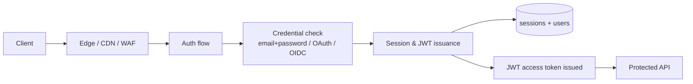
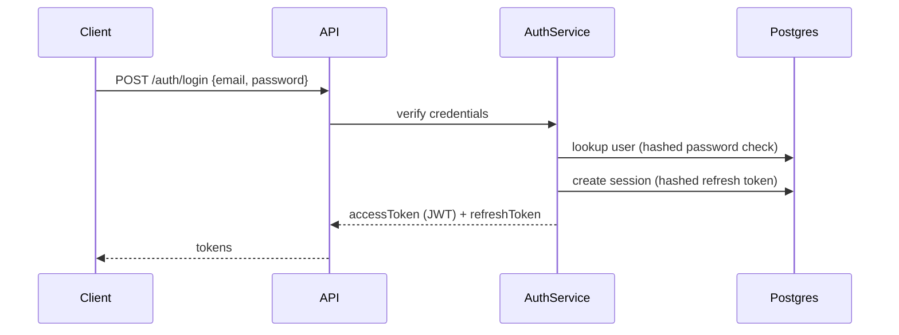
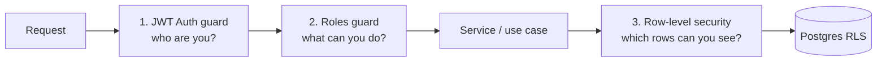
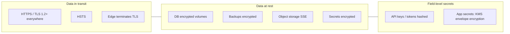
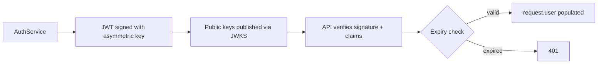
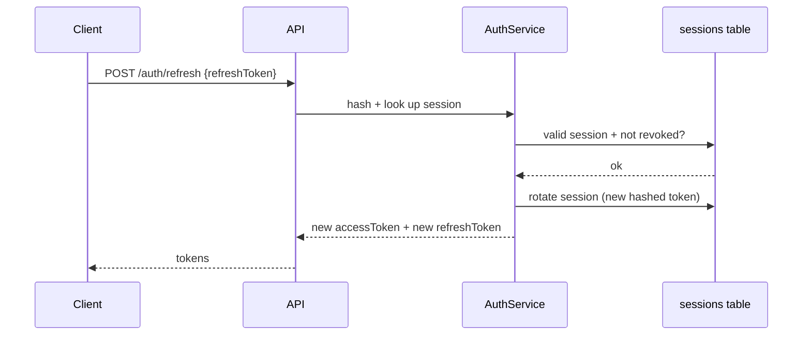
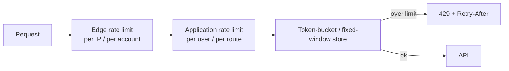
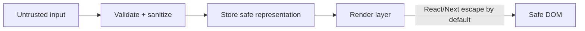
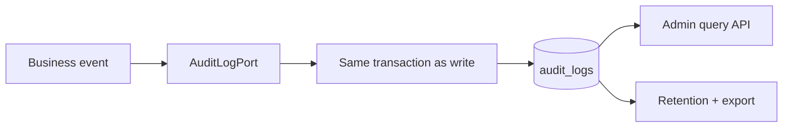
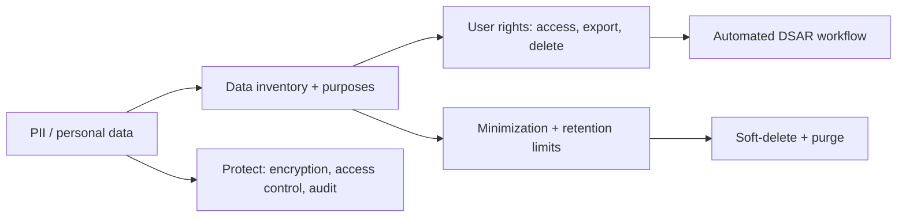

# Creative Digital Company — Security Architecture

- **Document type:** Security architecture
- **Author:** CTO (Founding Engineer)
- **Version:** 1.0
- **Status:** Draft for board review
- **Date:** 2026-08-02
- **Companion docs:** [Technology Strategy](/CRE/issues/CRE-6#document-technology-strategy),
  [System Architecture](/CRE/issues/CRE-6#document-system-architecture),
  [Backend Architecture](/CRE/issues/CRE-6#document-backend-architecture),
  [Database Architecture](/CRE/issues/CRE-6#document-database-architecture),
  [DevOps Architecture](/CRE/issues/CRE-6#document-devops-architecture),
  [API Specification](/CRE/issues/CRE-6#document-api-specification)
- **Scope:** security across the full stack — the static marketing site, serverless functions, the
  NestJS backend, Postgres, and the eventual product applications.

> **No implementation code is included.** This document is the design: mechanisms, responsibilities,
> threat model, and the controls we commit to. Implementation tickets follow adoption (Roadmap M5+).

---

## 0. Security principles

1. **Defense in depth** — controls at every layer (transport, edge, application, data), never a
   single gate.
2. **Least privilege** — tokens, roles, DB connections, and secrets carry only what they need.
3. **Zero trust on data** — every query is tenant-scoped; authorization is re-validated per request.
4. **Fail closed** — deny by default; exceptions are explicit and reviewed.
5. **Assume breach** — encrypt at rest and in transit, audit everything, rotate keys, and prepare
   incident response.
6. **No security in obscurity** — no secrets in source, no homegrown crypto, documented controls.

---

## 1. Authentication

**Mechanisms:**
- **Primary:** email + password with hashed credentials (argon2id), plus optional **OAuth/OIDC**
  (Google, GitHub) via managed identity provider (System Architecture §7).
- **Secondary factor (MFA/TOTP):** offered on accounts with admin/owner/billing roles and
  recommendable for all — required for admin console access.
- **Email verification:** required before an account can create/join companies or act as owner
  (prevents shadow accounts).
- **Password reset:** signed, expiring token; uniform responses whether or not the account exists
  (no account enumeration).
- **Sessions:** server-side session records (`sessions` table) storing hashed refresh tokens with
  device/IP context, revocable on logout, password change, or admin action.

---

## 2. Authorization

**Two complementary layers (Backend Architecture §10):**

1. **Authentication guard** verifies the JWT and populates `request.user`.
2. **RBAC guard** checks capability codes (`project.read`, `project.write`, `admin`, …) at the
   route level.
3. **Row-Level Security (RLS)** at the database is the final authority — even a compromised or
   misconfigured service cannot read another tenant's rows.

**Rules:**
- Every protected route declares auth; authorization is never a client-side concern.
- Capability checks use stable codes from the `permissions` table (Database Architecture §9).
- Ownership checks inside services for object-level access (e.g., document edit requires
  membership + role).

---

## 3. RBAC (Role-Based Access Control)

**Roles** (company-level, from Database Architecture `roles`/`permissions`):

| Role      | Typical permissions                                            | Default for |
| --------- | ------------------------------------------------------------- | ----------- |
| `owner`   | Everything incl. billing, members, delete company             | Company creator |
| `admin`   | Everything except billing/delete-company                       | Invited admins |
| `editor`  | Create/edit documents, AI usage                                | Contributors |
| `viewer`  | Read-only                                                     | External/stakeholders |
| `billing` | Subscription + invoices                                        | Finance role |

**Global roles** (platform level, admin console only): `platform_admin`, `support`.

**Conventions:**
- Roles → permissions mapping stored and enforced server-side; UI hides actions but never trusts.
- Permission revocation is effective immediately (guard checks DB, not cached claims).
- No role escalation path except `platform_admin` (audited, MFA-required).
- Invitation-based onboarding keeps membership explicit and revocable.

---

## 4. Encryption

**Controls:**
- **In transit:** TLS 1.2+ enforced end-to-end (edge → origin), HSTS, no mixed content.
- **At rest:** managed DB encryption (Postgres volumes), encrypted backups (DevOps §9), SSE on
  object storage, secrets encrypted in the platform secret store.
- **Passwords:** argon2id (memory-hard), unique salt per user; never reversible.
- **Refresh tokens:** stored hashed (SHA-256) in `sessions`, never in plaintext.
- **Sensitive app data** (e.g., AI/API provider keys, payment keys): envelope encryption via KMS —
  a DEK per tenant/object, wrapped by a master key. Keys separated from data; rotation supported.
- **No custom crypto.** Only audited, maintained libraries (OpenSSL/NSS, JOSE, AES-GCM).

---

## 5. JWT (access tokens)

**Design (aligned with Backend Architecture §9):**
- **Asymmetric signing (RS256/ES256):** private key signs, public keys published at a JWKS endpoint
  for verification — no shared secret between services.
- **Claims:** `sub` (userId), `org` (active company), `roles`/`permissions`, `iat`, `exp`, `jti`.
- **Short-lived:** access tokens ~15 minutes; refreshed via refresh token (§6).
- **Stateless verification** with key cache; no DB hit per request.
- **JTI** enables targeted revocation/audit; `exp` always required and enforced.
- Token **scope** is minimal — a token for the current company cannot see another company's data
  (RLS backs this regardless).

---

## 6. Refresh tokens

**Rules:**
- Refresh tokens are **opaque, high-entropy, single-use** and **rotated** on every refresh.
- Stored **hashed**; the server never retains the plaintext.
- **Server-side revocation:** logout, password change, and admin suspension revoke the session
  immediately (and all sessions where required).
- **Replay detection:** reusing an already-rotated token revokes the entire session family
  (theft indicator).
- **Sliding expiry** policy: inactivity timeout + absolute cap; sessions closed after both.
- Refresh tokens are never sent to third parties and are bound to device/IP context (with adaptive
  checks).

---

## 7. Rate limiting

**Layers:**
- **Edge/CDN/WAF** — global per-IP caps, DDoS mitigation, bot filtering.
- **Application (NestJS)** — per-user, per-route limits with stricter budgets on write routes.

| Route class          | Example limits (defaults)          |
| -------------------- | ---------------------------------- |
| Auth (login, reset)  | 5–10 / min / account + IP          |
| AI generation/chat   | Per-plan quota + burst limit       |
| Write routes         | e.g., 60 / min / user              |
| Read routes          | e.g., 300 / min / user             |
| Admin console        | Strict; MFA required               |

**Notes:**
- Limits are per-account **and** per-IP; retry-after honored; overflow surfaces `429` (specified in
  the API Specification).
- Rate-limit state uses a shared store (Redis), so limits hold across replicas/functions.
- Alerts fire when a user/company repeatedly hits limits (abuse signal).

---

## 8. OWASP Top 10 mapping

| # | OWASP A10 2021                       | Controls we implement                                                            |
| - | ------------------------------------ | -------------------------------------------------------------------------------- |
| A01 | Broken Access Control             | RBAC guards + RLS on every query; deny by default; ownership checks; revoked immediately |
| A02 | Cryptographic Failures            | TLS everywhere, argon2id, KMS envelope encryption, no custom crypto, key rotation |
| A03 | Injection                          | Parameterized queries only (Prisma); no raw SQL; input validation; WAF rules     |
| A04 | Insecure Design                    | Threat modeling per feature; security design review; RLS-first data access       |
| A05 | Security Misconfiguration          | Hardened headers, minimal config, IaC review, dependency/compliance scanning in CI |
| A06 | Vulnerable & Outdated Components   | Automated dependency + container scanning in CI; curated upgrade policy          |
| A07 | Identification & Auth Failures     | MFA for privileged roles, short-lived JWT, rotated refresh tokens, session revocation |
| A08 | Software & Data Integrity Failures | Signed artifacts/attestations, immutable image tags, supply-chain scanning (DevOps §5–6) |
| A09 | Security Logging & Monitoring Failures | Structured audit logs + metrics (§11), alerting, runbooks (DevOps §11)       |
| A10 | Server-Side Request Forgery        | Outbound allowlists, URL validation, no user-controlled hosts for internal calls |

---

## 9. SQL injection

- **All persistence via Prisma / ORM with parameterized queries** — no string-concatenated SQL
  anywhere (Backend Architecture §6: repositories are the only DB access).
- Repository layer is the **single** path to data; ad-hoc SQL prohibited by convention and lint.
- **RLS as a second line:** even a bypassed filter cannot cross tenant boundaries.
- Validation limits shape/type of inputs before they reach queries.
- **Defense:** static analysis in CI (SQL pattern scan), E2E tests include injection attempts
  (`' OR 1=1 --`), and security lint rules fail the build.

---

## 10. XSS (Cross-Site Scripting)

**Controls:**
- **Framework escaping:** React/Next.js escape output by default; never use
  `dangerouslySetInnerHTML` without an allowlisted sanitizer (e.g., DOMPurify) and review.
- **Input validation + sanitization** at the API boundary; HTML in user content is either stripped
  or sanitized to an allowlisted subset (markdown → safe HTML pipeline).
- **Content Security Policy (CSP)** restricts script sources; no inline scripts; `nonce`/`hash`
  where required.
- **Output encoding** context-aware (HTML, attribute, URL, JS).
- **`X-Content-Type-Options: nosniff`** and MIME-type enforcement; cookies `HttpOnly`+`Secure`+
  `SameSite`.
- Static-site content (marketing site) uses no user-controlled HTML by design.

---

## 11. CSRF (Cross-Site Request Forgery)

**Because the API is authenticated via `Authorization` header (not cookies), the classic CSRF
vector is largely neutralized. Residual controls:**

- **Cookie policy:** session/refresh cookies, where used, are `SameSite=Strict`/`Lax` +
  `Secure` + `HttpOnly`; the API does not authenticate by cookie.
- **State-changing requests** require the bearer token; CORS restricts cross-origin calls to
  allowlisted origins only (preflight enforcement, no `Access-Control-Allow-Origin: *` with
  credentials).
- **Double-submit / CSRF tokens** used for any cookie-based surfaces (admin console, preview
  iframes) as defense-in-depth.
- **CSP frame-ancestors** blocks clickjacking; `X-Frame-Options: DENY` on interactive apps.

---

## 12. Audit logs

**Design (from Database Architecture §7):**
- Every security-relevant and business write records an audit entry **in the same transaction**
  (no partial writes without a trail).
- **Fields:** `id`, `action`, `actorUserId`, `targetType`/`targetId`, `changes` (before/after),
  `requestId`, `ip`, `userAgent`, `createdAt`.
- **Append-only:** no update/delete by applications; retention + archival policy (e.g., 90 days hot,
  then cold/export); platform admin query surface (`GET /admin/audit-log` in the API spec).
- **Logged events include:** auth (login/logout/failed), role changes, member add/remove,
  document create/update/delete (with revision), payment/subscription changes, flag toggles,
  export/download of data.
- Audit entries are **untrusted by application code** — only `platform_admin` can query them, and
  deletion is restricted.

---

## 13. Security headers

**Baseline response headers applied at edge + origin:**

| Header                          | Value (baseline)                                    | Purpose                 |
| ------------------------------- | --------------------------------------------------- | ----------------------- |
| `Strict-Transport-Security`     | `max-age=31536000; includeSubDomains`               | Enforce HTTPS           |
| `Content-Security-Policy`       | restrictive (no inline scripts; allowlisted sources) | Mitigate XSS/injection |
| `X-Content-Type-Options`        | `nosniff`                                           | MIME sniffing           |
| `X-Frame-Options`               | `DENY` (interactive apps) / `SAMEORIGIN` (site)     | Clickjacking            |
| `Referrer-Policy`               | `strict-origin-when-cross-origin`                   | Leak reduction          |
| `Permissions-Policy`            | restrictive default                                 | Feature abuse reduction |
| `Cache-Control`                 | `no-store` on auth/personal endpoints               | PII caching             |
| `Cross-Origin-Opener-Policy`    | `same-origin` (interactive apps)                    | Isolation               |

**Enforcement:** headers set at the edge (Netlify) and mirrored by the API; verified by a security
header check in CI smoke tests; HSTS preload planned for production launch.

---

## 14. Data privacy

**Principles (privacy-by-design, GDPR-aligned):**
- **Data inventory** — map of personal data (users, members, activity) with purpose + retention.
- **Minimization** — collect only what a feature needs; default retention windows.
- **Access controls** — PII only visible to members/roles with a need; never in logs.
- **User rights** — self-service access, export, and deletion (DSAR) surfaced in the API/UI.
- **Deletion** — soft-delete immediately, hard-purge after retention period (Database §8);
  company deletion purges member data per policy.
- **Children's data** — not supported; age gate at sign-up.
- **No third-party data sales**; processor agreements with providers (analytics, AI, payments,
  email).
- **Consent** — explicit, revocable; preference store (marketing vs. transactional).
- **Breach handling** — incident runbook (DevOps §10) + notification obligation; documented in the
  runbook.

---

## 15. Security testing & CI

- **SAST** (static analysis) in CI on every push.
- **Dependency/container scanning** (DevOps §2, §6) — fail on known critical/high.
- **Secret scanning** — pre-commit and CI; block accidental commits (Safety & Permissions rules).
- **DAST** — scheduled scans against staging (auth flows, injection, XSS probes).
- **Manual pen test / threat model** — before public product launch (Roadmap M8 gate).
- **Security E2E tests** — auth, RBAC/RLS isolation, injection, XSS, rate limit, headers.

---

## 16. Production-hardening checklist (security)

- [ ] TLS + HSTS everywhere; security headers verified in CI.
- [ ] JWT asymmetric + short-lived; refresh rotated, hashed, revocable.
- [ ] MFA required for owner/admin/platform_admin.
- [ ] RBAC guard coverage on every protected route; RLS enabled + verified.
- [ ] No raw SQL; repository-only data access; injection E2E tests.
- [ ] CSP + no inline scripts; sanitized rich content only.
- [ ] CSRF defenses for any cookie surface; CORS allowlisted.
- [ ] Audit log on every business write (same transaction); append-only + retention.
- [ ] Rate limiting at edge + app with shared store.
- [ ] Secrets in managed store; envelope encryption for app data; rotation plan.
- [ ] Dependency + secret scanning green in CI; DAST scheduled.
- [ ] Privacy: data inventory, DSAR workflow, retention + purge policy.

---

## 17. Next action

Board review/adoption of this security architecture. On approval, the CTO will:
1. Land the auth/RBAC/RLS foundation (JWT guard, roles guard, audit port, security headers) in the
   M5 backend scaffold with E2E security tests.
2. Add secret scanning + security header checks + dependency scanning to CI.
3. Produce the incident-response runbook and DSAR workflow as part of M8 production hardening.
