# Creative Digital Company — System Architecture

- **Document type:** System architecture (current + target state)
- **Author:** CTO (Founding Engineer)
- **Version:** 1.0
- **Status:** Draft for board review
- **Date:** 2026-08-02
- **Companion docs:** [Technology Strategy](/CRE/issues/CRE-6#document-technology-strategy),
  [Software Development Roadmap](/CRE/issues/CRE-6#document-roadmap)

---

## 0. Architecture summary

The architecture follows the **static-first** principle (TDR-001/002/006): today the public
surface is a fully static site served by a CDN with no server. The **target architecture** (this
document) describes the layered system we adopt as products and Workstreams B/C land, adding
serverless functions, a managed database, AI services, auth, queues, notifications, monitoring, and
analytics **only when a product need requires them**.

Every diagram below is Mermaid and renders on GitHub and in Mermaid-enabled Markdown viewers.

---

## 1. High-level architecture

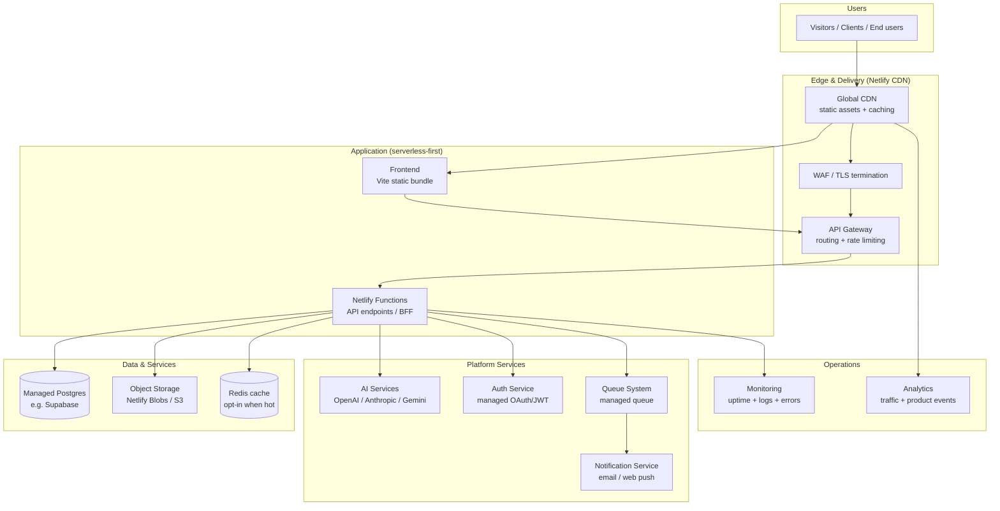

**Principles encoded here:**
- Static content never touches a server — it is served from the CDN edge.
- All dynamic work enters through one gateway into serverless functions.
- Platform services (AI, auth, queue, notifications) are **managed** — no self-hosting.
- Everything reports to monitoring and analytics in a sidecar/edge manner.

---

## 2. Microservices

We do **not** run a distributed microservice fleet today. For a 1–3 engineer company, a
**serverless-function monolith (BFF) with clearly bounded modules** is the right default
(see TDR-006). "Services" are logical, independently deployable functions/units.

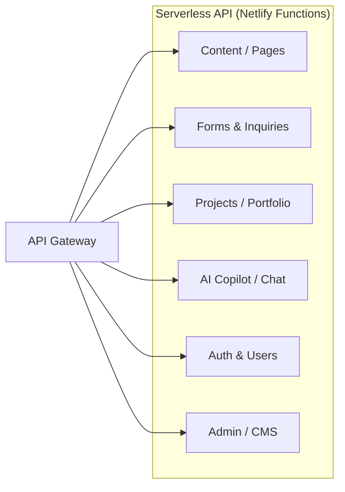

**Rules:**
- Each function/service is independently deployable and has a bounded responsibility.
- Services communicate **only** through the gateway or the queue — no direct calls.
- When a single function's responsibility outgrows the function runtime, it graduates to a
  dedicated managed service; we never "split for splitting's sake."

---

## 3. Frontend

**Stack (TDR-001):** Vite + vanilla JavaScript (ES modules) + semantic HTML/CSS. No framework
today; native Web Components when reusable widgets arrive. Progressive enhancement and
accessibility are non-negotiable.

```mermaid
flowchart TB
    subgraph Build["Build time"]
        SRC[src/ (JS + CSS + HTML)]
        VITE[Vite build]
        LINT[ESLint + Prettier]
        TEST[Vitest + smoke tests]
        DIST[dist/ static bundle]
    end

    subgraph Runtime["Runtime"]
        CDN2[Netlify CDN]
        INDEX[index.html]
        JS[hashed JS asset]
        CSS[hashed CSS asset]
        IMG[assets: favicon / images]
    end

    SRC --> VITE
    LINT --> VITE
    TEST --> VITE
    VITE --> DIST
    DIST --> CDN2
    CDN2 --> INDEX
    CDN2 --> JS
    CDN2 --> CSS
    CDN2 --> IMG
    JS --> API[Serverless API (when interactive)]
```

**Frontend decisions:**
- Core content renders without JS (progressive enhancement); JS only enhances.
- All assets hashed and long-cacheable; CDN serves them without server round-trips.
- Any interactive feature calls the serverless API through the gateway with HTTPS.

---

## 4. Backend

**Stack (TDR-006):** Serverless functions (Netlify Functions, edge/regional) as the BFF; managed
Postgres for persistence; Redis cache only when hot reads demand it.

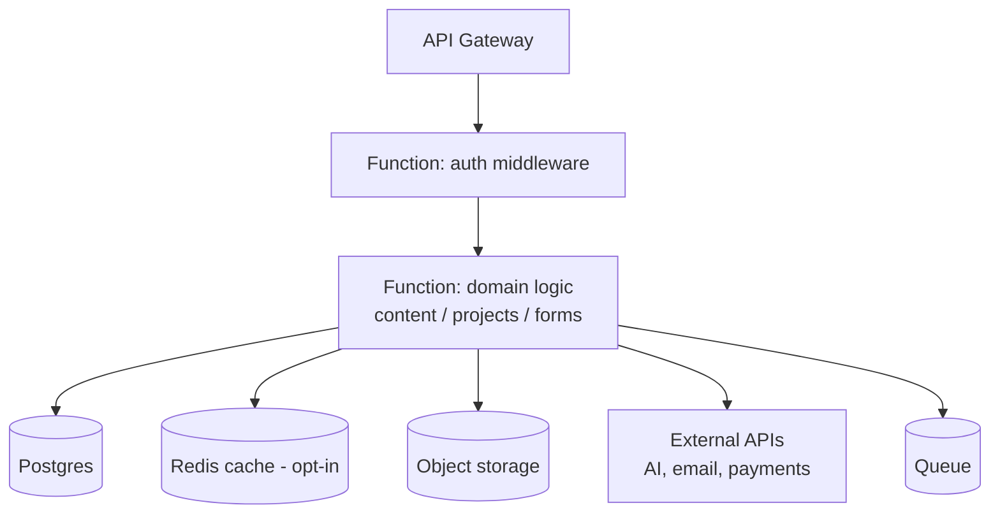

**Backend decisions:**
- Stateless functions; all state lives in Postgres/storage/queue.
- Middleware (auth, validation, rate-limit) applied at the gateway or first function layer.
- No always-on servers; functions scale with demand and idle at zero cost.
- Configuration via environment/secrets on the hosting platform — never in source.

---

## 5. Database

**Default:** managed Postgres (e.g., Supabase). **Nothing else until a requirement is proven.**

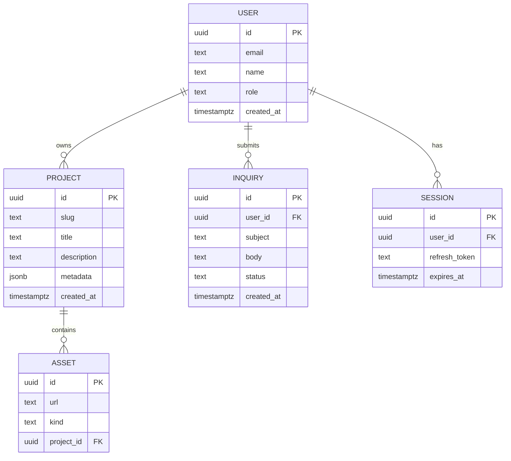

**Database decisions:**
- Row-level security (RLS) at the database, not just the API.
- Schema migrations committed to the repo; no ad-hoc DDL.
- Postgres JSONB used sparingly for flexible metadata; relational model first.
- Backups and TLS managed by the provider.

---

## 6. AI services

**Stack (TDR-007):** managed AI APIs (OpenAI / Anthropic / Gemini) called from serverless
functions. Keys are platform secrets. Human review required for client-facing output.

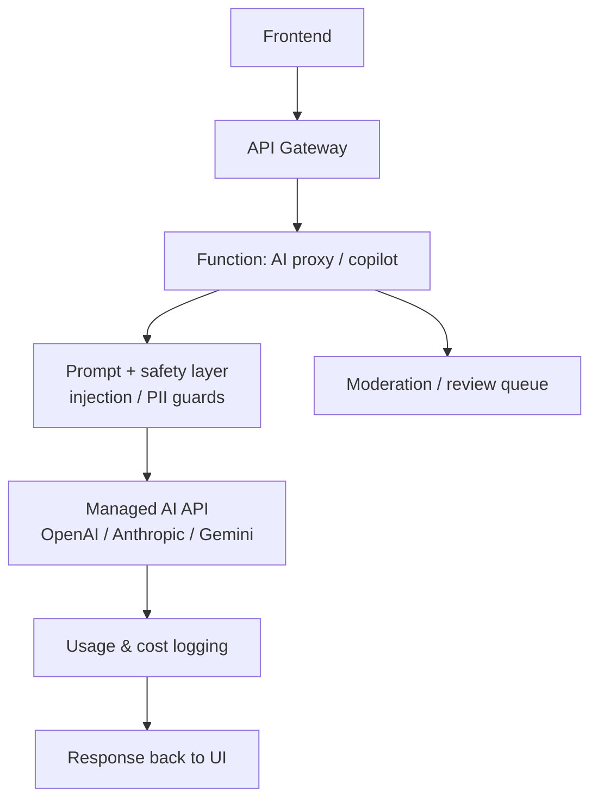

**AI decisions:**
- All AI calls go through our function (never direct from the browser) so keys stay secret.
- Prompt templates versioned in the repo; output logged for cost + audit.
- Safety review required per feature (prompt injection, PII, hallucination risk).
- Cost tracked per feature; provider selection is a TDR decision with board approval when it
  involves committed spend.

---

## 7. Authentication

**Stack:** managed auth (OAuth2/OIDC — e.g., Supabase Auth / Netlify Identity) with JWT;
session refresh tokens in a cookie/secure store. Row-level security enforces per-user access.

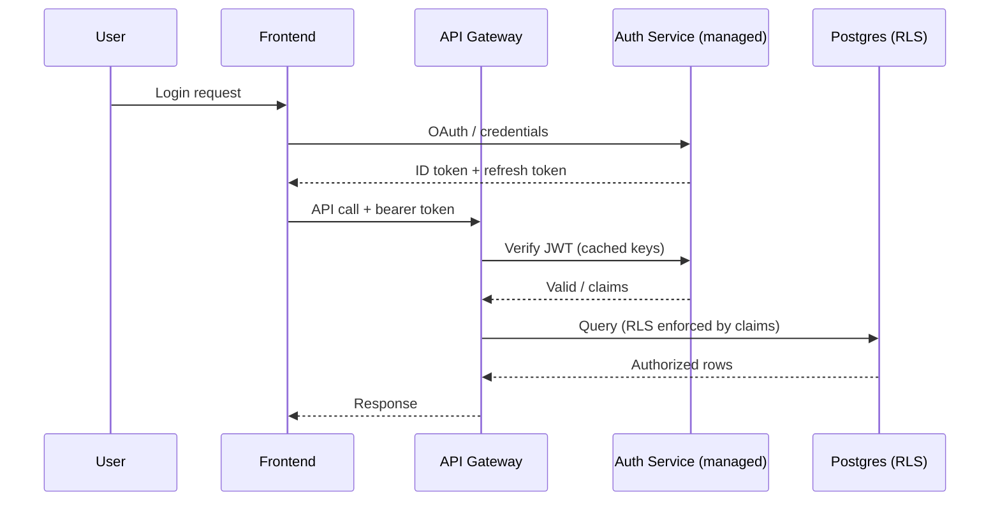

**Auth decisions:**
- No self-hosted identity server.
- Token verification cached to avoid per-request latency.
- Admin/author roles enforced at DB RLS + API middleware.

---

## 8. Storage

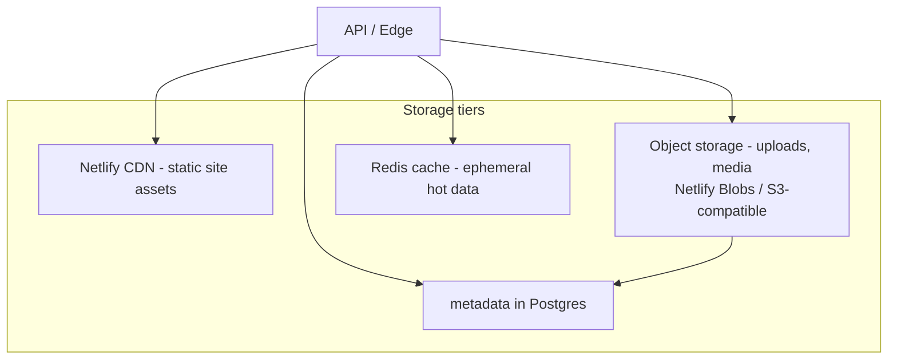

**Storage decisions:**
- **Static:** CDN (fastest, zero server).
- **Binary uploads:** object storage with metadata rows in Postgres.
- **Relational:** Postgres.
- **Cache:** Redis only when profiling shows a hot read path that Postgres/CDN cannot serve.
- Backup/retention policy documented per tier (provider-managed for managed tiers).

---

## 9. API Gateway

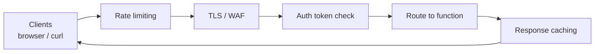

**Gateway decisions:**
- Provided by the hosting platform edge (Netlify) — no self-hosted gateway today.
- Responsibilities: TLS, routing, rate limiting, request validation, authz bootstrap, response
  caching (CDN for static, edge cache for safe dynamic responses).
- Gateway rules live in `netlify.toml`/redirects as code.
- If a self-hosted gateway is ever required (unlikely at this scale), it is a TDR decision.

---

## 10. Queue system

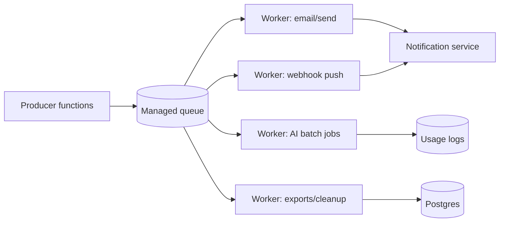

**Queue decisions:**
- Managed queue (e.g., hosted queue/Supabase queue or a managed broker) — no self-hosted Kafka/RabbitMQ.
- Purpose: decouple slow/fan-out work (notifications, AI batches, exports) from request time.
- Retry + dead-letter policy per worker; idempotency keys for safe retries.
- Adopt only when request-time work actually exceeds function limits — otherwise keep it synchronous.

---

## 11. Notification service

```mermaid
flowchart TB
    QN[(Queue)] --> NS[Notification Service]
    NS --> CH1[Email provider]
    NS --> CH2[Web push / in-app]
    NS --> CH3[Webhook to client systems]
    NS --> PREF[Preference store (Postgres)]
    QN --> SN[Status ledger / delivery log]
```

**Notification decisions:**
- Single notification service owns templates, channel routing, and delivery logs.
- Templates versioned; per-channel failure isolation (one channel failing never blocks others).
- Unsubscribe/preference management required before any outbound campaign.
- Managed providers (email/transactional + push) — no self-hosted SMTP/push infra.

---

## 12. Monitoring

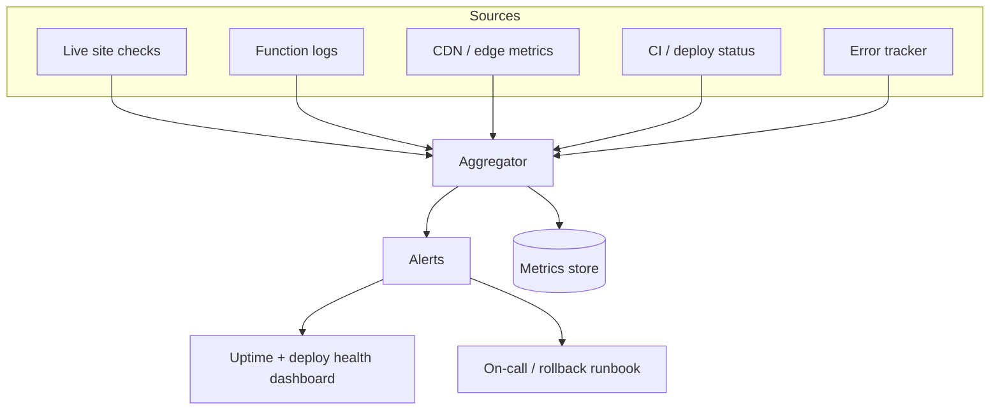

**Monitoring decisions (staged):**
- **Stage 1 (now):** uptime HTTP checks on the live URL + CI/deploy run status.
- **Stage 2 (with traffic/functions):** Netlify Analytics, structured function logs, hosted error
  tracking (e.g., Sentry), synthetic checks on key flows.
- Alerts require owners; no alert without a runbook action.
- Logs never contain secrets/PII; events, not raw dumps.

---

## 13. Analytics

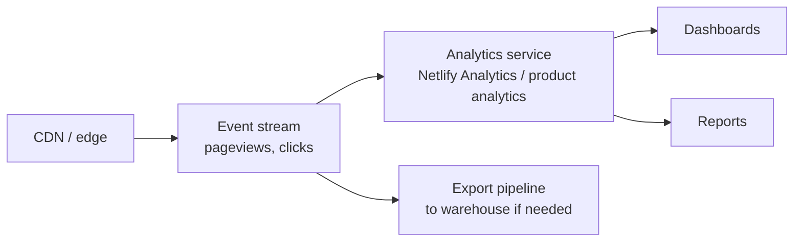

**Analytics decisions:**
- Privacy-friendly defaults first (Netlify Analytics — no cookie banner required).
- Product/event analytics added when a product feature needs funnel insight.
- PII is not collected in raw events; IP/device data minimized.
- Instrumentation is additive and non-blocking — never in the critical path.
- Export to a warehouse only when reporting outgrows the analytics service.

---

## 14. Target topology (all layers together)

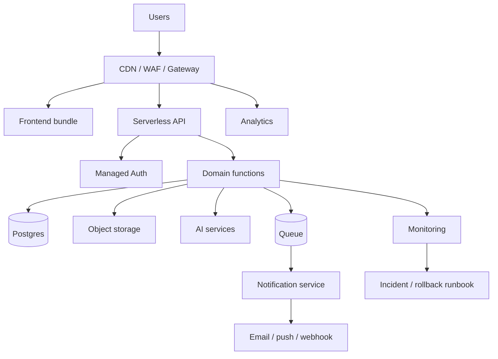

---

## 15. Adoption path (ties to roadmap)

| Layer               | Today       | Adopt at milestone | Trigger                       |
| ------------------- | ----------- | ------------------ | ----------------------------- |
| Frontend (static)   | ✅ Live     | M2 (done)          | —                             |
| CI/CD               | ✅ Live     | M2 (done)          | —                             |
| Design system       | Ad-hoc CSS  | M3                 | Rebrand + component reuse     |
| Product template    | —           | M4                 | First client product          |
| Serverless API      | —           | M4/M5              | First interactive feature     |
| Database (Postgres) | —           | M5                 | Persistent data requirement   |
| Auth                | —           | M5                 | Gated/private content         |
| AI services         | —           | M5+                | Product feature ticket        |
| Queue + notif       | —           | M6                 | Async/fan-out workload        |
| Monitoring          | Uptime+CI   | M6                 | More than static surface      |
| Analytics           | —           | M6/M7              | Traffic needs measurement     |
| Production launch   | —           | M8                 | Go/no-go review               |

## 16. Architecture principles (recap)

1. **Static-first** — serve what can be static from the CDN; add servers only for real need.
2. **Serverless before servers** — functions scale with demand and cost nothing idle.
3. **Managed over self-hosted** — databases, auth, AI, queues, notifications, observability.
4. **Gateway as the only front door** — no direct service-to-service calls.
5. **Security by default** — TLS, secrets, RLS, least-privilege tokens, no secrets in code.
6. **Observable from day one** — uptime + deploy health now; deeper telemetry when it matters.
7. **Everything as code** — topology, gateway rules, migrations, and workflows live in the repo.

## 17. Next action

Board review/adoption of this architecture. On approval, the CTO will:
1. Formalize the design-system + component layer (M3) against the Frontend/Storage sections.
2. Open implementation tickets for the serverless API + Postgres (M5) when a product need is
   confirmed.
3. Keep `netlify.toml` and CI/deploy as the executable representation of the edge/gateway section.
