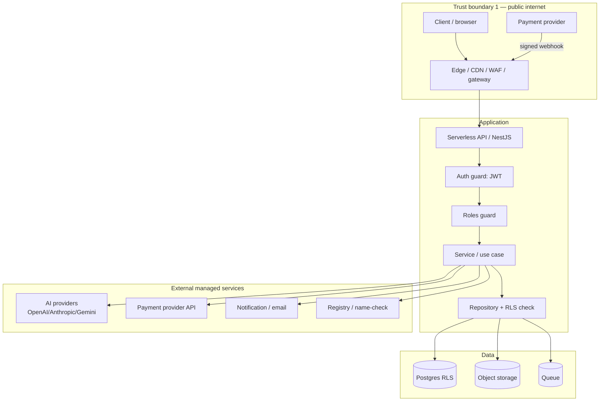
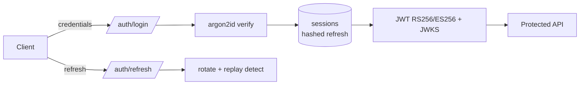
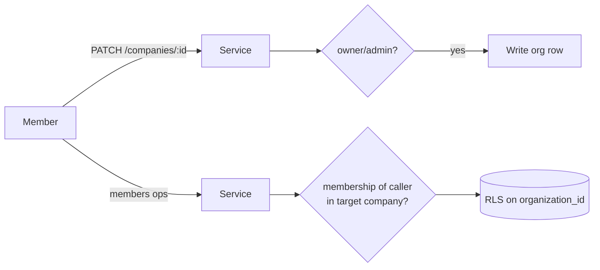
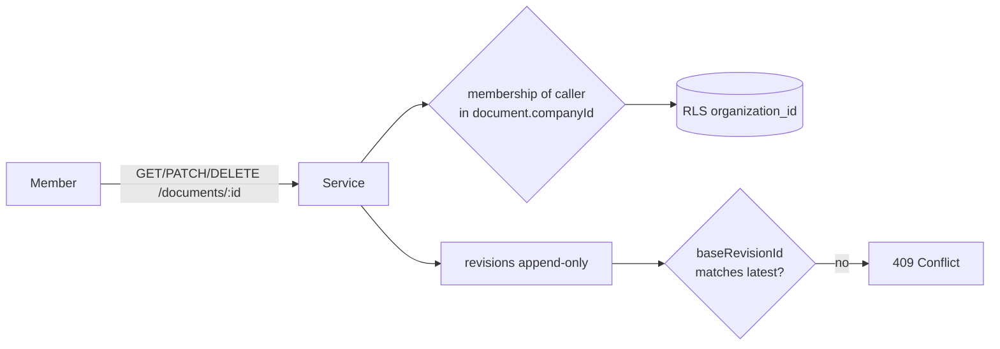
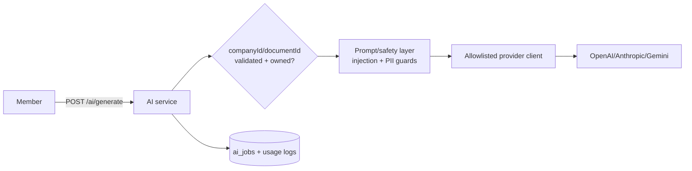
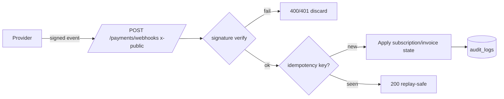
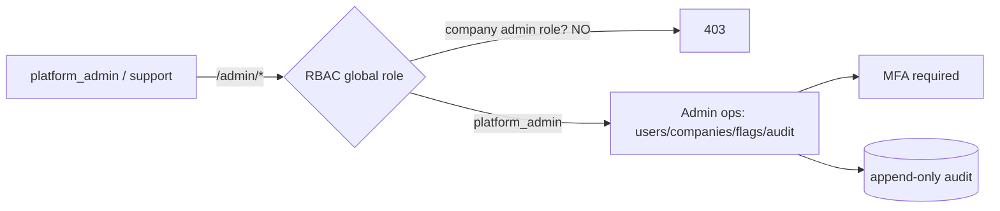

# CRE-30 — Baseline Threat Model + OWASP API Security Top 10 (2023) Review

- **Document type:** Security threat model
- **Author:** CTO (Founding Engineer)
- **Version:** 1.0
- **Status:** Baseline — for SecLead review; feeds [BackendLead](/CRE/agents/backendlead) implementation and [QALead](/CRE/agents/qalead) security test planning (Roadmap M5)
- **Date:** 2026-08-02
- **Sources:** [Security Architecture](/CRE/issues/CRE-6#document-security-architecture),
  [System Architecture](/CRE/issues/CRE-6#document-system-architecture),
  [Backend Architecture](/CRE/issues/CRE-6#document-backend-architecture),
  [Database Architecture](/CRE/issues/CRE-6#document-database-architecture),
  [API Specification](/CRE/issues/CRE-6#document-api-specification) (`openapi.yaml`)
- **Related:** [CRE-28](/CRE/issues/CRE-28) (SecLead onboarding), [CRE-6](/CRE/issues/CRE-6) (Security Architecture)

---

## 0. Summary

The approved [Security Architecture](/CRE/issues/CRE-6#document-security-architecture) maps OWASP
**Top 10 (Web)** but does not model threats per service or map the **OWASP API Security Top 10
(2023)**. This document fills that gap for the six core services in the target architecture, before
any M5 implementation starts. It produces:

1. STRIDE threat model + data-flow diagram per service (§2).
2. OWASP API Security Top 10 (2023) control mapping per service (§3).
3. Object-level ownership-check audit for every API route that takes an id (§4).
4. SSRF review for outbound AI / registry / name-check / provider calls (§5).
5. Consolidated findings register with class, evidence, blast radius, fix, residual risk (§6).

**Top residual risks to fix before/at M5 implementation:**

| # | Risk | Status today |
| - | ---- | ------------ |
| F-01 | BOLA via body-carried ids (`companyId`, `projectId`, `documentId`) — RBAC routes guard paths, not bodies | **Gap** — RLS mitigates at DB, but service layer must re-validate membership for every id in the body |
| F-02 | AI job result access (`GET /ai/jobs/{id}`) — `AiJob` has no ownership column in the schema | **Gap** — needs `ownerUserId`/`companyId` + RLS or service check |
| F-03 | `GET /notifications/{id}/read` — `Notification` has no `userId` in the schema | **Gap** — must be user-scoped |
| F-04 | Invitation accept binds only by `invitationId`; email↔invite linkage unverified | **Gap** — must bind to authenticated user's email |
| F-05 | SSRF: AI/registry/name-check outbound hosts must be allowlisted, never user-controlled | **Partial** — design says outbound allowlists (Security Arch §8 A10); no concrete list |
| F-06 | `AiGenerateRequest.options` is a free-form object (`additionalProperties: true`) passed to providers | **Gap** — unsanitized parameter passthrough / mass-assignment risk |
| F-07 | Admin console must require the **global** `platform_admin` role, not company-level `admin` | **Partial** — Security Arch distinguishes global roles but route guard contract unverified |
| F-08 | Payments webhook is the only `x-public` route; must signature-verify + idempotency-key every event | **Partial** — API spec says signature-verified; idempotency/replay not yet specified |

The architecture's defense-in-depth (JWT + RBAC + RLS + audit) already covers several API Top 10
items well (API2 auth, API8 misconfig, API10 via managed clients). The findings are concentrated in
**API1 BOLA**, **API3 BOPLA**, **API4 resource consumption**, and **API7 SSRF**.

---

## 1. Scope, trust boundaries, assets

### 1.1 Services in scope

| Service | Routes (from `openapi.yaml`) | Notes |
| ------- | ---------------------------- | ----- |
| **Authentication / Session** | `/auth/*`, `/users/me`, `/users/me/password` | JWT access + rotating refresh tokens, sessions, email verification, password reset |
| **Companies / Membership** | `/companies`, `/companies/{id}`, `/companies/{id}/members*`, invitations | Roles `owner/admin/editor/viewer/billing`; RLS tenant root |
| **Documents / Revisions** | `/documents`, `/documents/{id}`, `/documents/{id}/revisions*` | Versioned revisions, optimistic concurrency via `baseRevisionId` |
| **AI proxy** | `/ai/generate`, `/ai/chat`, `/ai/jobs`, `/ai/jobs/{id}` | Sync + async jobs; outbound to managed AI providers |
| **Payments webhook** | `/payments/*` (esp. `POST /payments/webhooks`, `x-public: true`) | Provider-signed inbound events; subscription/invoice state |
| **Admin console** | `/admin/*` | `platform_admin`/`support` global roles; metrics, users, companies, flags, audit log |

### 1.2 Trust boundaries

**Boundary rules:**
- **TB1→TB2:** TLS, WAF, edge rate limit. Clients are untrusted; all ids in paths *and bodies*
  are attacker-controlled.
- **TB2→TB3:** RLS is the final data authority; the repository layer is the only DB path.
- **TB2→TB4:** outbound calls must use **allowlisted clients** — the service never accepts a
  user-supplied host/URL for outbound fetch (see §5).
- **Provider→TB2 (webhook):** the single unauthenticated inbound; must be signature-verified and
  idempotent before state changes.

### 1.3 Assets & impact classes

| Asset | Confidentiality | Integrity | Availability |
| ----- | --------------- | --------- | ------------ |
| User credentials + sessions | High | High | Medium |
| Company/tenant data (docs, revisions, members) | High | High | Medium |
| AI prompts + outputs (may embed PII) | High | Medium | Low |
| Subscription/invoice/billing state | High | High | Low |
| Admin/audit data | High | High | Medium |
| Provider keys (AI, payments) | **Critical** | High | Low |

### 1.4 Assumptions

- CUIDs are **non-enumerable** but are **not** an authorization control — ownership must be
  re-validated per request (RLS + service checks).
- `RLS` keyed on `organization_id` is the backstop (Database Arch §10); API-layer RBAC guards are
  the first line. Both must exist; neither alone is sufficient.
- Managed platform services (Supabase/Auth, Stripe, AI providers) are trusted for their own
  controls; we still verify signatures and keep keys server-side.
- This model targets **M5 implementation**; findings are "implement before the route ships" unless
  marked otherwise.

---

## 2. STRIDE analysis per service

Legend: **✓** designed control · **△** partial / must be enforced at implementation · **✗** gap to fix.

### 2.1 Authentication / Session

| STRIDE | Threat | Existing control | Status | Notes |
| ------ | ------ | ---------------- | ------ | ----- |
| S | Account takeover via credential stuffing | Argon2id, rate limit 5–10/min/IP+account | ✓ | Security Arch §7 |
| S | Stolen refresh token reuse | Rotated, hashed, replay → family revoke | ✓ | Security Arch §6 |
| T | JWT forgery | Asymmetric signature + JWKS, exp/jti enforced | ✓ | Security Arch §5 |
| T | Refresh-token tampering | Server-side hash lookup; never client-trusted | ✓ | Security Arch §6 |
| R | Auth events non-repudiation | `audit_logs` in same tx (login/logout/failed/reset) | ✓ | Security Arch §12 |
| I | Account enumeration | Uniform forgot-password responses | ✓ | openapi `/auth/forgot-password` |
| D | Login/register DoS | Edge + app rate limits | ✓ | Security Arch §7 |
| E | Privilege escalation via reset flow | Reset revokes all sessions; token signed+expiring | ✓ | Security Arch §1 |
| E | Unverified email acting as owner | Email verification required before create/join company | ✓ | Security Arch §1 |
| ✗ | **BOPLA on `/users/{id}`** — redaction of fields for non-members unspecified | Service-level field projection | **△** | Define which fields redacted for non-members (see F-09) |

**Session service notes:**
- Access JWT 15 min / refresh rotated + single-use (Security Arch §5–6) — strong.
- **Residual:** adaptive device/IP checks are "with adaptive checks" (design intent) — must be
  implemented, not assumed.
- `PATCH /users/me` and `PATCH /users/me/password` operate on the authenticated subject only —
  no id in path, BOLA not applicable; BOPLA still applies (see F-10).

### 2.2 Companies / Membership

| STRIDE | Threat | Existing control | Status | Notes |
| ------ | ------ | ---------------- | ------ | ----- |
| S | Impersonate another member | Auth guard + RBAC | ✓ | |
| T | Change org data cross-tenant | RLS on `organization_id` | ✓ | Database Arch §10 |
| R | Membership/role changes unlogged | Audit in same tx (role change, add/remove) | ✓ | Security Arch §12 |
| I | Member email/roles leak cross-tenant | RLS; `GET /companies/{id}/members` scoped | ✓ | |
| D | Invitation spam / mass-join | Edge+app rate limit on invite route | **△** | Add explicit invite rate limit |
| E | **Invitation hijack** — accept an invite sent to someone else | Only `invitationId` in route; no email binding | **✗** | See F-04: bind `invitation.email` to authenticated user's email |
| E | **Role escalation** — `editor` promotes self | RBAC: role change owner/admin only | ✓ | Security Arch §3 |
| E | Last-owner / self-removal edge cases | "owner cannot remove self" documented | **△** | Spec says owner cannot remove self; define last-owner lockout behavior |

**Membership service notes:**
- Membership is a 3-tuple `(user, org, role)` with `@@unique([userId, organizationId])` — RLS
  friendly.
- **Residual BOLA surface:** body-carried company ids — e.g., `POST /companies/{id}/members`
  invite uses `{email, role}` (path-scoped, fine); `PATCH /companies/{id}/members/{userId}` — must
  confirm `userId` is a member **of that company** before role change (else cross-tenant role write).

### 2.3 Documents / Revisions

| STRIDE | Threat | Existing control | Status | Notes |
| ------ | ------ | ---------------- | ------ | ----- |
| S | Edit/read doc of another tenant | RLS + membership check | ✓ | |
| T | Lost-update overwrite | Optimistic concurrency `baseRevisionId` → 409 | ✓ | openapi `UpdateDocumentRequest` |
| T | Revision chain tampering | Revisions append-only; revision history via document | **△** | Enforce append-only at repo layer |
| R | Doc create/update/delete unlogged | Audit with revision | ✓ | Security Arch §12 |
| I | Revision content leaks | RLS on document scope; revisions keyed off document | ✓ | |
| D | Unbounded content / revision growth | Content length + revision count caps unspecified | **△** | See F-11 |
| E | BOLA via **body** ids | `CreateDocumentRequest {companyId, projectId}` | **△** | Must validate `projectId` ∈ `companyId` and caller membership (F-01) |
| ✗ | **BOPLA** — `status` transition (`draft→approved`) | Any editor can set `approved`? | **✗** | Define status transition permissions (see F-12) |

**Documents service notes:**
- Strong point: optimistic concurrency removes lost-update race as a tamper vector.
- **Residual:** `documentId` in `AiGenerateRequest`/`AiChatRequest` must be validated to belong to
  the caller's company (cross-service BOLA, F-01).

### 2.4 AI proxy

| STRIDE | Threat | Existing control | Status | Notes |
| ------ | ------ | ---------------- | ------ | ----- |
| S | Prompt injection (manipulate model to leak data) | Prompt/safety layer + moderation queue | ✓ | System Arch §6 |
| S | Forge AI result / cross-tenant job read | `GET /ai/jobs/{id}` — **no owner column** | **✗** | F-02: add `ownerUserId`/`companyId` + RLS |
| T | Tamper with job result | Results server-generated; job state machine | **△** | Enforce state transitions server-side |
| R | Usage/cost unlogged | Usage logging per feature | ✓ | System Arch §6 |
| I | Prompt/output contains PII | PII guards at safety layer; redaction in logs | **△** | Never log raw prompts; redact at write time |
| D | **Unrestricted resource consumption** (token blowout / cost) | Plan quota + burst limit; per-route limit | **△** | Quota = authz check on every generation; `402` when exhausted (F-13) |
| D | Provider abuse via **options passthrough** | `options: additionalProperties: true` | **✗** | F-06: schema-validate options; no raw passthrough |
| E | **SSRF via model/provider selection** | `model` is a free string | **✗** | F-05/F-14: allowlist models; never accept endpoint URLs |

**AI proxy notes:**
- AI keys are server-side platform secrets (System Arch §6) — good; never sent to client.
- Provider endpoints are fixed managed hosts (OpenAI/Anthropic/Gemini) — SSRF surface is low *if*
  the client never accepts a host from user input (F-14).

### 2.5 Payments webhook

| STRIDE | Threat | Existing control | Status | Notes |
| ------ | ------ | ---------------- | ------ | ----- |
| S | Forged webhook (fake payment) | Signature verification (provider-signed) | **△** | API spec says signature-verified; specify mechanism + constant-time compare (F-08) |
| T | Replayed event → double-apply | Idempotency key (provider event id) | **✗** | F-08: idempotent handlers mandatory |
| R | Payment/sub changes unlogged | Audit | ✓ | Security Arch §12 |
| I | Cross-tenant subscription mutation | Webhook resolves company from **server-side** mapping, never client body | **△** | F-15 |
| D | Webhook flood / unbounded replay | Edge rate limit + payload size | **△** | Add specific webhook limits |
| E | Privilege escalation via webhook fields | Ignore user-controllable fields; only apply verified event data | **△** | F-15 |

**Payments webhook notes:**
- The webhook is `x-public: true` — the **only** unauthenticated state-changing surface. It must be
  the most rigorously verified route.
- **BOLA note:** `GET /payments/invoices/{id}` is authenticated and RLS-scoped to company — fine.

### 2.6 Admin console

| STRIDE | Threat | Existing control | Status | Notes |
| ------ | ------ | ---------------- | ------ | ----- |
| S | Admin impersonation | MFA required for admin console | ✓ | Security Arch §1 |
| E | **Company-level `admin` elevated to platform admin** | RBAC route guard must check **global** `platform_admin` | **△** | F-07: distinct guard; no role-name collision |
| I | Cross-tenant data in admin queries | Admin legitimately reads all; audit-restricted queries | ✓ | audit log query limited to `platform_admin` |
| T | Feature-flag abuse | `PATCH /admin/feature-flags/{key}` admin-only | **△** | Add flag value schema validation |
| R | Admin actions unlogged | Append-only audit | ✓ | |
| D | Admin API enumeration/bruteforce | Strict rate limit + MFA | **△** | Explicit per Security Arch §7 |
| E | **Global role escalation** via `PATCH /admin/users/{id} {roles:[...]}` | Assign global roles admin-only | **△** | F-16: allowlist assignable global roles; audit |

**Admin console notes:**
- The **role-name collision** is the key trap: a company member role is called `admin`, and the
  platform global role is `platform_admin`. The guard must test the **global** claim, not the
  company claim.

---

## 3. OWASP API Security Top 10 (2023) mapping

Legend: **✓** covered by design · **△** partial — implement per §2/§6 · **✗** gap to fix.

| # | API Risk (2023) | Auth/Session | Companies | Documents | AI proxy | Payments | Admin |
| - | --------------- | ------------ | --------- | --------- | -------- | -------- | ----- |
| API1 | **Broken Object Level Authorization** | ✓ self-scoped | △ membership/body ids | △ body ids, revisions | **✗** job owner | ✓ RLS invoices | ✓ |
| API2 | **Broken Authentication** | ✓ strong | ✓ | ✓ | ✓ | **△** webhook only | ✓ MFA |
| API3 | **Broken Object Property Level Authz** | △ field redaction | △ last-owner rules | **✗** status transitions | **✗** options passthrough | △ webhook fields | △ global role grant |
| API4 | **Unrestricted Resource Consumption** | ✓ rate limits | △ invite limit | **△** content caps | **✗** token/quota caps | △ webhook limits | △ admin limits |
| API5 | **Broken Function Level Authz** | ✓ | ✓ RBAC | △ route-level only | △ sync vs async quota | △ cancel/change roles | **△** global-vs-company admin |
| API6 | **Unrestricted Access to Sensitive Business Flows** | △ register spam | △ invite spam | — | △ quota-gated flow | — | — |
| API7 | **SSRF** | — | — | — | **✗** model/host allowlist | — | — |
| API8 | **Security Misconfiguration** | ✓ | ✓ | ✓ | ✓ | △ webhook hardening | ✓ |
| API9 | **Improper Inventory Management** | — | — | — | △ provider/model inventory | △ env keys (test/live) | △ flags/env |
| API10 | **Unsafe Consumption of APIs** | — | — | — | **△** allowlisted clients only | **△** signature check | — |

**Where we are strong:** API2 (JWT asymmetric, rotated refresh, MFA), API8 (TLS, headers, hardened
config, validation pipes), API10 (managed clients, no custom crypto, provider SDKs).

**Where we must act before M5:** API1 (BOLA on body ids + AI job/notification ownership), API3
(status transitions, options schema, field redaction), API4 (content/token caps), API5 (global admin
guard), API7 (outbound allowlist).

---

## 4. Object-level ownership-check audit (every id-bearing route)

Scope item 3: verify object-level ownership checks exist everywhere the API takes an id. Audit of
`openapi.yaml` routes (CUID ids). `RLS` = DB row-level security on `organization_id` (Database Arch
§10). Service check = an explicit in-service verification beyond RLS.

### 4.1 Path-id routes

| Route | Id(s) | Auth | Ownership control today | Verdict |
| ----- | ----- | ---- | ----------------------- | ------- |
| `GET /users/{id}` | user id | ✓ | Service must redact fields for non-members | **△** F-09 (redaction spec) |
| `GET /companies/{id}` | company id | ✓ | RLS membership | ✓ |
| `PATCH /companies/{id}` | company id | ✓ | RBAC owner/admin + RLS | ✓ |
| `GET /companies/{id}/members` | company id | ✓ | RLS membership | ✓ |
| `POST /companies/{id}/members` (invite) | company id | ✓ | RBAC owner/admin | ✓ |
| `PATCH /companies/{id}/members/{userId}` | company+user id | ✓ | RBAC owner/admin + **must verify `userId` ∈ company** | **△** F-17 |
| `DELETE /companies/{id}/members/{userId}` | company+user id | ✓ | RBAC owner/admin; owner cannot remove self | **△** F-17 |
| `POST /companies/{id}/invitations/{invitationId}/accept` | company+invitation id | ✓ | **Must bind `invitation.email` to caller email + `invitation.companyId` = path id** | **✗** F-04 |
| `GET /documents/{id}` | document id | ✓ | RLS on document.companyId | ✓ |
| `PATCH /documents/{id}` | document id | ✓ | RLS + RBAC editor | ✓ |
| `DELETE /documents/{id}` | document id | ✓ | RLS + RBAC editor | ✓ |
| `GET /documents/{id}/revisions` | document id | ✓ | RLS | ✓ |
| `GET /documents/{id}/revisions/{revisionId}` | doc+revision id | ✓ | RLS + **revision must belong to document** | **△** F-18 |
| `GET /ai/jobs/{id}` | job id | ✓ | **No owner column; no RLS/service check specified** | **✗** F-02 |
| `GET /payments/invoices/{id}` | invoice id | ✓ | RLS on invoice.companyId | ✓ |
| `POST /notifications/{id}/read` | notif id | ✓ | **No `userId`; must be user-scoped** | **✗** F-03 |
| `GET /admin/users/{id}` | user id | ✓ | Global `platform_admin` guard | **△** F-07 |
| `PATCH /admin/companies/{id}` | company id | ✓ | Global `platform_admin` guard | **△** F-07 |

### 4.2 Body/query-carried id routes (BOLA blind spot)

| Route | Id(s) in body/query | Control needed | Verdict |
| ----- | ------------------- | -------------- | ------- |
| `POST /documents` | `companyId`, `projectId` | Caller ∈ `companyId`; `projectId` ∈ `companyId` | **△** F-01 |
| `GET /documents?companyId=&projectId=` | query ids | RLS scoping | ✓ |
| `POST /ai/generate` | `companyId`, `documentId` | Caller ∈ `companyId`; `documentId` ∈ `companyId` | **✗** F-01 |
| `POST /ai/chat` | `companyId`, `documentId` | Same as above | **✗** F-01 |
| `POST /ai/jobs` | `companyId`, `documentId` | Same as above | **✗** F-01 |
| `POST /payments/checkout` | `planId`, `companyId` | Caller ∈ `companyId` + billing rights | **△** F-19 |
| `GET /payments/subscription?companyId=` | query id | Caller ∈ `companyId` | ✓ |
| `GET /payments/invoices?companyId=` | query id | Caller ∈ `companyId` | ✓ |

**Conclusion:** path-id routes are largely covered by RLS + RBAC. The **real BOLA surface is
body/query-carried ids** and **entities with no ownership column** (`AiJob`, `Notification`). Both
must be closed in the M5 schema/repository layer.

---

## 5. SSRF review (outbound calls)

**Rule:** all outbound calls go through **allowlisted clients**; hosts are never taken from user
input. Outbound destinations today:

| Outbound | Destination(s) | Allowlist | Status |
| -------- | -------------- | --------- | ------ |
| AI inference | OpenAI / Anthropic / Gemini (fixed hosts) | Hardcode provider base URLs; never from `model`/`options` | **△** F-14 |
| AI model selection | `model` string in `AiGenerateRequest` | Map `model` → enum of known provider+model; reject unknown | **✗** F-14 |
| Registry / name-check | Business registry / name availability APIs | Allowlist client + fixed endpoint | **△** F-05 |
| Payments provider API | Stripe (server-side) | Provider SDK with fixed API host | ✓ |
| Notification / email | Email/push providers | Provider SDKs | ✓ |
| Object storage | Netlify Blobs / S3 | Managed SDK | ✓ |
| Webhook outbound (client systems) | Customer webhooks | **Never user-controlled host; register+allowlist targets** | **△** F-05 |

**Do not do:** any route that accepts a URL/domain from user input and fetches it server-side
(avatar URLs, logo URLs, webhook destinations). If user URLs are stored (`avatarUrl`, `logoUrl`,
`pdfUrl`), they are rendered client-side only, and any server fetch is from an allowlisted
cache/validator — see F-20.

---

## 6. Consolidated findings register

Columns: **Class** (STRIDE / API# 2023) · **Evidence** · **Blast radius** · **Fix** · **Residual
risk**. Priority: P0 = block, P1 = implement at M5, P2 = hardening.

| ID | Class | Evidence | Blast radius | Fix | Residual risk | P |
| -- | ----- | -------- | ------------ | --- | ------------- | - |
| **F-01** | BOLA / API1 | `openapi.yaml`: `CreateDocumentRequest`, `AiGenerateRequest`, `AiChatRequest` carry `companyId`/`projectId`/`documentId` in body | Cross-tenant read/write of docs + AI context via forged body ids (RLS is backstop but UI/RBAC doesn't catch it) | At service boundary: resolve caller membership for every body-carried company id; validate child ids belong to that company; centralize in a `TenantScopeGuard`/service helper | Low if RLS intact; medium if any repository path bypasses RLS | **P0** |
| **F-02** | BOLA / API1 | `AiJob` schema (openapi) has no `ownerUserId`/`companyId` | Cross-tenant read of AI prompts/results + leaked usage/error strings | Add `ownerUserId` + `companyId` to `ai_jobs`; RLS policy; `GET /ai/jobs/{id}` scopes to owner | Low after fix | **P0** |
| **F-03** | BOLA / API1 | `Notification` schema (openapi) has no `userId` | Mark another user's notification read; list leaks | Add `userId` + RLS; `/notifications` scoped to authenticated user | Low after fix | **P0** |
| **F-04** | BOLA / API1 | `POST /companies/{id}/invitations/{invitationId}/accept` | Invitation hijack — accept an invite sent to a different email | Bind: `invitation.status = pending`, `invitation.companyId = :id`, `invitation.email = caller.email`; single-use + expiry | Low (CUID) after fix | **P0** |
| **F-05** | SSRF / API7 | Security Arch §8 A10 "outbound allowlists"; no concrete registry/name-check design | SSRF into internal networks or abusive scanning via user-controlled hosts | Register allowlisted clients for AI/registry/name-check; deny user-supplied hosts; egress firewall if applicable | Low once enforced | **P0** |
| **F-06** | BOPLA / API3 + API4 | `AiGenerateRequest.options: additionalProperties: true` | Mass-assignment/provider-param abuse → unexpected provider behavior, cost, prompt manipulation | Define a strict options schema (allowlist keys + types); reject unknown; strip before provider call | Low after fix | **P0** |
| **F-07** | BFLA / API5 | Security Arch §3 global `platform_admin` vs company `admin`; `/admin/*` guard contract unverified | Company `admin` accidentally granted platform admin (role-name collision) | Dedicated global-roles guard (`platform_admin`) distinct from company RBAC; E2E test asserting company admin → 403 on `/admin/*` | Low after guard + test | **P0** |
| **F-08** | Spoofing/Tamper / API10 | `POST /payments/webhooks` `x-public: true`; spec says "signature-verifies" | Forged webhook grants subscription / replay double-charges | Provider signature verification (constant-time), **idempotency key** per event id, verify live/test env secret, replay-safe 200 | Low after fix | **P0** |
| **F-09** | BOPLA / API3 | `GET /users/{id}` "redacted fields for non-company members" | Email/status leakage to non-members | Define exact redaction (email, status, emailVerified hidden for non-members); E2E test | Low | **P1** |
| **F-10** | BOPLA / API3 | `PATCH /users/me` | Self field-mutation beyond allowlist (e.g., trying `emailVerified`/`roles`) | Whitelist updatable fields (`fullName`, `avatarUrl`); reject unknown (global pipe already `forbidNonWhitelisted`) | Low | **P1** |
| **F-11** | DoS / API4 | `Document.content` unbounded (openapi, no maxLength); revisions unlimited | Storage/DB bloat; slow queries | Cap content size + revision count per document; paginate revisions; enforce in DTO + repo | Medium (mitigated by rate limit) | **P1** |
| **F-12** | BOPLA / API3 | `DocumentStatus` transitions (`draft→approved`) | Editor can approve/archive against workflow | Define transition matrix (e.g., only `owner/admin` approve); enforce in service, not UI | Low | **P1** |
| **F-13** | DoS / API4 | AI quota = "per-plan quota + burst" (Security Arch §7) | Token/cost blowout; abusive generation | Enforce quota as pre-request authz check (plan limit), `402` when exhausted; monitor alert | Low | **P1** |
| **F-14** | SSRF / API7 | `AiGenerateRequest.model` free string | Provider/host confusion; SSRF if model maps to URL | Map model → allowlisted enum; reject unknown models; provider client uses fixed base URL | Low after fix | **P1** |
| **F-15** | Spoofing/Tamper / API10 | Webhook handler company resolution unspecified | Cross-tenant subscription mutation | Resolve company from **server-side** mapping (subscription/invoice record), never from payload body | Low after fix | **P1** |
| **F-16** | BFLA / API5 + BOPLA | `PATCH /admin/users/{id} {roles:[...]}` | Grant `platform_admin`/`support` to anyone an admin edits | Allowlist assignable global roles; only `platform_admin` grants `platform_admin`; audit every grant | Low | **P1** |
| **F-17** | BOLA / API1 | `PATCH/DELETE /companies/{id}/members/{userId}` | Change/remove a member of a *different* company (cross-tenant role write) | Verify membership `(userId, companyId)` exists + caller is owner/admin of `companyId`; define last-owner rule | Low | **P1** |
| **F-18** | BOLA / API1 | `GET /documents/{id}/revisions/{revisionId}` | Revision of a *different* document | Scope revision lookup by `(documentId, revisionId)`; RLS on document | Low | **P2** |
| **F-19** | BFLA / API5 | `POST /payments/checkout {companyId}` | Create checkout for a company you don't belong to; abuse billing | Caller ∈ `companyId` + billing role; company active; plan valid | Low | **P2** |
| **F-20** | SSRF / API7 | `avatarUrl`, `logoUrl`, `pdfUrl` are user-set URLs | Stored-URL abuse; mixed content; SSRF if ever fetched server-side | Client-side rendering only; scheme+host validation on save; any server fetch via allowlisted validator/cache | Low | **P2** |
| **F-21** | DoS / API6 | Invitation/register abuse | Spam invites / mass accounts | Per-account+IP invite rate limit; register rate limit; email-verified gate | Low | **P2** |
| **F-22** | Misconfig / API9 | API9 inventory: staging/prod webhook secrets, model/provider inventory, flags | Test-mode webhook events applying to prod; stale endpoints | Env-separated webhook secrets + `livemode` check; model/provider inventory doc; flag env mapping | Low | **P2** |

**Priority rollup:** 7 × P0 (F-01…F-08) block the M5 implementation of the affected routes; the
rest are P1/P2 hardening to fold into the M5 module tickets.

---

## 7. Verification plan (how this gets proven)

- **E2E security tests (QALead / BackendLead, M5):**
  - BOLA: user A cannot GET/PATCH/DELETE doc/member/job/notification of user B's company (401/403/404
    all acceptable — **never** 200 with data).
  - Body-id BOLA: `POST /documents {companyId: <other-company>}` → 403; `POST /ai/generate
    {companyId, documentId}` cross-company → 403.
  - BFLA: company `admin` calling `/admin/*` → 403; only `platform_admin` passes.
  - Invitation hijack: user with a different email tries to accept another's invite → 403.
  - Webhook: unsigned/malformed/replayed event → 400 and **no** state change; duplicate event id → 200
    no-op.
- **RLS policy tests:** each tenant table has a policy keyed on `organization_id`; a raw
  connection (no API) cannot read across tenants.
- **SSRF test:** any route accepting a URL (model, avatar, webhook target) rejects internal/loopback
  hosts; only allowlisted clients can fetch.
- **API4 test:** oversized document/options/quota-exhausted → 413/402/429 with no provider call.
- **DAST + SAST + dependency scan** in CI (Security Arch §15) scheduled against staging.

---

## 8. Owners & next actions

| Action | Owner | Depends on |
| ------ | ----- | ---------- |
| Review/approve this threat model; refine findings | [SecLead](/CRE/agents/seclead) | This document |
| Fold P0–P1 findings into M5 backend scaffold tickets (schema: `ai_jobs`, `notifications` ownership columns; `TenantScopeGuard`; global-roles guard; options/content schemas) | [BackendLead](/CRE/agents/backendlead) via EM | SecLead approval |
| Add BOLA/BFLA/SSRF/webhook E2E + RLS policy tests to security test plan | [QALead](/CRE/agents/qalead) | BackendLead schema/guards |
| Confirm AI provider/registry outbound allowlist + model inventory | [AILead](/CRE/agents/ailead) + CTO | — |
| Sign off global-vs-company admin guard and webhook idempotency contract | CTO + [SecLead](/CRE/agents/seclead) | — |

> This is a **baseline**; re-run the model per feature (Security Arch §8 A04 "threat modeling per
> feature") before new services/endpoints ship.
